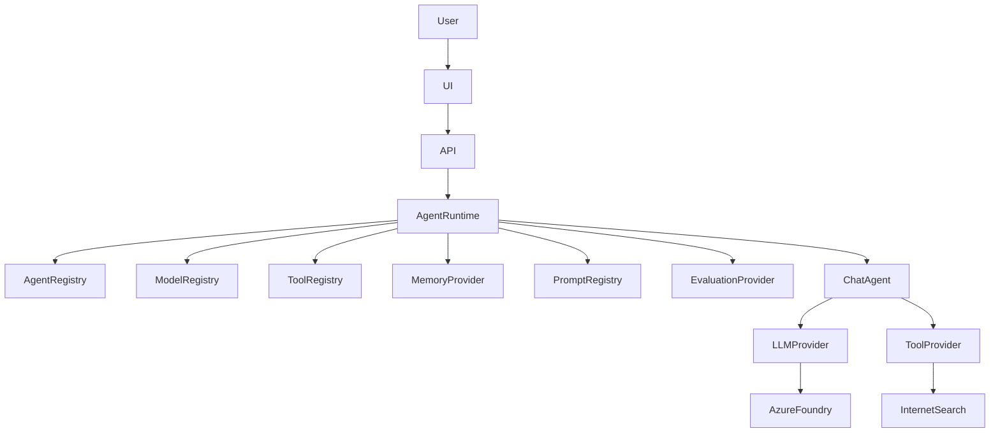
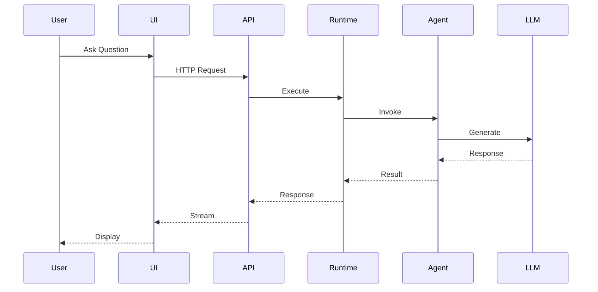
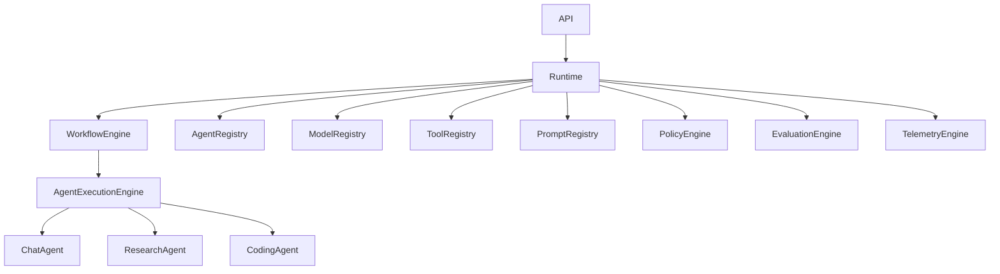
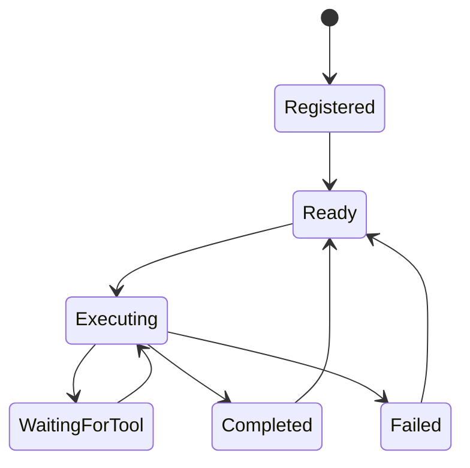
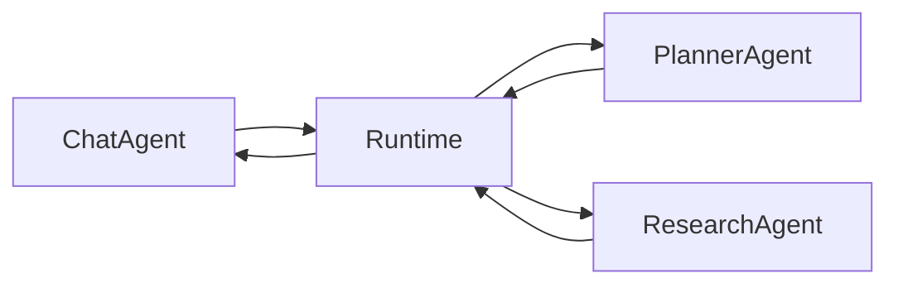
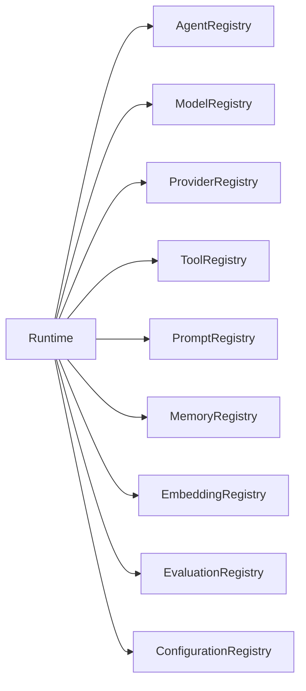
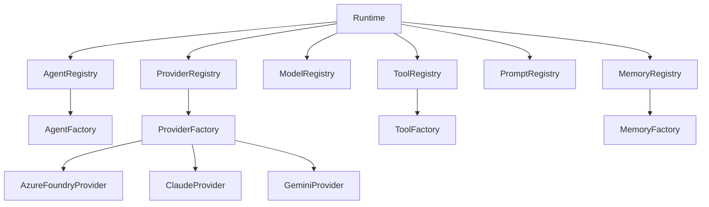
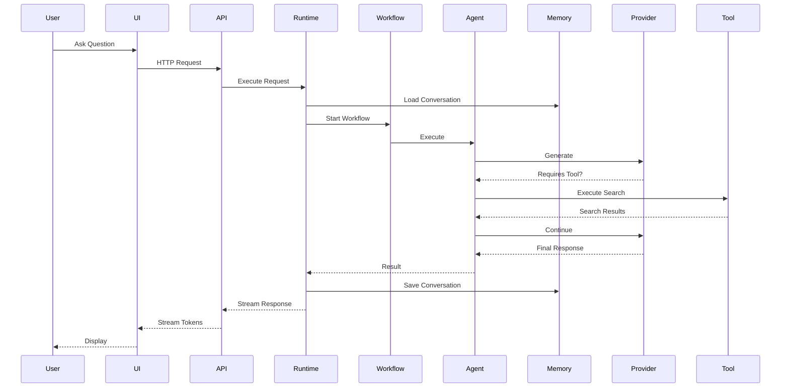
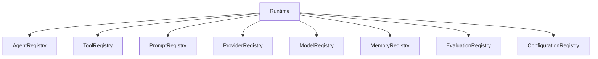

# Enterprise Multi-Agent AI Platform

# Architecture Design Document (ADD)

Version 1.0

Status

Active

---

# 1. Architecture Goals

The platform shall be designed as an enterprise-grade reusable AI platform.

The architecture should satisfy:

✔ Extensible

✔ Modular

✔ Provider Agnostic

✔ Cloud Native

✔ Observable

✔ Testable

✔ Secure

✔ Cost Optimized

✔ Event Ready

✔ Multi-Agent Ready

✔ MCP Ready

The architecture should support future growth without requiring major refactoring.

---

# 2. Design Principles

The architecture follows:

- Clean Architecture
- SOLID
- Domain Driven Design (lightweight)
- Hexagonal Architecture
- Dependency Injection
- Provider Pattern
- Registry Pattern
- Factory Pattern
- Strategy Pattern
- Event-Driven Extension Points

Business logic shall never depend on infrastructure.

---

# 3. Platform Architecture

```text
                    Users
                      │
                      ▼
             Presentation Layer
                      │
                      ▼
                Platform Layer
                      │
                      ▼
                 Agent Layer
                      │
                      ▼
               AI Services Layer
                      │
                      ▼
             Infrastructure Layer
```

Each layer owns specific responsibilities.

---

# 4. Layer Responsibilities

## Presentation Layer

Responsibilities

Chat UI

REST API

Authentication

Streaming

Validation

Session

WebSocket/SSE

No business logic.

---

## Platform Layer

Responsibilities

Agent Runtime

Registries

Configuration

Policies

Routing

Execution

Evaluation

Tracing

Observability

This is the heart of the system.

---

## Agent Layer

Contains specialized agents.

Examples

Chat Agent

Research Agent

Coding Agent

Document Agent

Planner Agent

Reviewer Agent

Vision Agent

Each agent focuses only on reasoning.

---

## AI Services Layer

Contains abstractions.

LLM Providers

Tool Providers

Memory Providers

Embedding Providers

Vector Providers

Prompt Providers

Search Providers

Evaluation Providers

No concrete cloud implementation should leak above this layer.

---

## Infrastructure Layer

Contains implementations.

Azure AI Foundry

Azure OpenAI

Anthropic

Gemini

DeepSeek

Ollama

OpenRouter

Redis

Cosmos DB

PostgreSQL

Azure AI Search

Azure Key Vault

Azure Monitor

Infrastructure changes must never affect business logic.

---

# 5. High-Level Component Diagram



---

# 6. Core Platform Components

The platform consists of:

Presentation

API

Agent Runtime

Agent Registry

Model Registry

Provider Registry

Tool Registry

Prompt Registry

Configuration Manager

Policy Engine

Evaluation Engine

Telemetry Engine

Memory Provider

LLM Provider

Tool Provider

Infrastructure

Each component should expose interfaces.

---

# 7. Component Responsibilities

Presentation

↓

User interaction

API

↓

Request validation

Agent Runtime

↓

Workflow orchestration

Agent Registry

↓

Agent discovery

Model Registry

↓

Model discovery

Provider Registry

↓

Provider discovery

Tool Registry

↓

Tool discovery

Prompt Registry

↓

Prompt loading

Memory Provider

↓

Conversation state

LLM Provider

↓

Inference

Evaluation Provider

↓

Metrics

Infrastructure

↓

Cloud integration

---

# 8. Request Lifecycle


---

# 9. Agent Runtime

The Agent Runtime is the core orchestration component of the platform.

It owns:

- Request lifecycle
- Agent selection
- Agent execution
- Agent communication
- Tool orchestration
- Memory coordination
- Policy enforcement
- Evaluation
- Telemetry

The Agent Runtime must remain independent of any LLM provider.

---

# 10. Runtime Component Diagram



---

# 11. Runtime Responsibilities

The runtime is responsible for:

Request validation

↓

Configuration resolution

↓

Agent lookup

↓

Workflow execution

↓

Tool coordination

↓

Memory coordination

↓

Model selection

↓

Evaluation

↓

Telemetry

↓

Response streaming

The runtime should not contain business-specific logic.

---

# 12. Workflow Engine

The Workflow Engine coordinates execution between one or more agents.

Initial implementation:

LangGraph

Future implementations:

- Semantic Kernel
- Custom workflow engine
- Azure AI Foundry Agent Service (optional)
- Durable Functions
- Event-driven orchestration

The Workflow Engine is responsible for:

- Sequential execution
- Parallel execution (future)
- Conditional branching
- Retry handling
- Workflow state
- Cancellation
- Timeouts

---

# 13. Agent Execution Engine

Responsibilities:

Instantiate agents

Resolve dependencies

Load prompts

Inject memory

Select provider

Execute reasoning

Return structured responses

The execution engine never communicates directly with cloud providers.

---

# 14. Agent Lifecycle

Every agent follows the same lifecycle.



---

# 15. Agent State

Every running agent should expose:

Agent ID

Execution ID

Conversation ID

Session ID

Workflow ID

Current State

Active Model

Current Provider

Active Tools

Memory Provider

Budget Used

Latency

Retries

Errors

The runtime owns lifecycle state.

---

# 16. Agent Registry

The Agent Registry is the authoritative catalog of available agents.

Responsibilities:

Register agents

Discover agents

Resolve agents

Version agents

Validate agent configuration

Future:

Dynamic loading

Marketplace integration

Plugin support

---

# 17. Agent Descriptor

Each agent declares metadata.

```yaml
id: chat-agent

version: 1.0

provider: azure-foundry

model: gemma-4

description: General conversational assistant

temperature: 0.2

max_tokens: 4096

tools:
  - internet-search

memory:
  provider: in-memory

budget:
  max_cost_per_request: 0.05

timeout: 120
```

Descriptors should be external configuration, not code.

---

# 18. Agent-to-Agent Communication

Agents must never call each other directly.

Instead:



Benefits:

Centralized tracing

Authorization

Budget enforcement

Timeouts

Retry logic

Observability

---

# 19. Runtime Events

The runtime publishes events.

Examples:

RequestReceived

WorkflowStarted

AgentStarted

AgentCompleted

ToolStarted

ToolCompleted

ModelInvoked

ModelCompleted

WorkflowCompleted

WorkflowFailed

These events enable telemetry and future asynchronous processing.

---

# 20. Execution Context

Each request carries an Execution Context.

Contains:

Correlation ID

Conversation ID

Session ID

Workflow ID

Request ID

Agent ID

User ID (future)

Tenant ID (future)

Locale

Feature Flags

Provider

Model

Prompt Version

Budget

Timeout

Execution Context flows through every component.

---

# 21. Policy Engine

The Policy Engine enforces runtime rules.

Policies include:

Model selection

Budget limits

Timeouts

Retries

Tool permissions

Maximum token usage

Streaming enablement

Safety rules (future)

The Policy Engine should be injectable and configurable.

---

# 22. Error Handling Strategy

Failures should be categorized.

Examples:

Configuration Error

Validation Error

Provider Error

Network Error

Tool Error

Timeout

Policy Violation

Unexpected Exception

The runtime should normalize errors into a consistent format before returning them to callers.

---

# 23. Retry Strategy

The runtime coordinates retries.

Rules:

Retry transient provider failures.

Do not retry validation failures.

Respect provider-specific rate limits.

Use exponential backoff with jitter.

Retries must be observable and configurable.

---

# 24. Response Streaming

Streaming is coordinated by the runtime.

Responsibilities:

Open stream

Forward tokens

Track time-to-first-token

Handle cancellation

Handle provider disconnects

Capture metrics

Close stream cleanly

Streaming implementation should remain provider-agnostic.

---

# 25. Runtime Extensibility

Future extensions should include:

Scheduled workflows

Event-driven workflows

Human approval steps

Long-running workflows

Parallel execution

Dynamic agent loading

Agent marketplace

Workflow designer

No architectural changes should be required to support these additions.

---

# 26. Registry Architecture

The platform shall use centralized registries to discover capabilities at runtime.

Registries are responsible for:

- Registration
- Discovery
- Validation
- Versioning
- Metadata
- Capability lookup

Registries never execute business logic.

---

# 27. Registry Overview



Every registry exposes a common interface.

---

# 28. Provider Registry

Purpose

Maintain available AI providers.

Initial providers

Azure AI Foundry

Future providers

Azure OpenAI

OpenAI

Anthropic

Gemini

DeepSeek

OpenRouter

Together AI

Ollama

vLLM

Each provider registers:

Provider ID

Display Name

Supported Models

Authentication Types

Streaming Support

Tool Calling Support

Structured Output Support

Vision Support

Embedding Support

Maximum Context Window

Health Status

Estimated Cost Metadata

---

# 29. Provider Interface

Every provider implements:

initialize()

health_check()

generate()

stream()

count_tokens()

estimate_cost()

list_models()

supports(feature)

close()

Business logic must never reference provider SDKs directly.

---

# 30. Provider-Neutral LLM Contract

## Objective

The platform shall interact with all Large Language Models through a provider-neutral contract.

Although the initial implementation targets Azure AI Foundry, business logic, agents, workflows, tools, and memory services shall not depend on Azure-specific request or response models.

The common contract should be compatible with OpenAI-style Chat APIs to maximize interoperability.

## Design Principles

- Business logic must never call provider SDKs directly.
- Provider SDKs remain encapsulated inside provider implementations.
- All requests are normalized before reaching a provider.
- All responses are normalized before returning to the Agent Runtime.
- Streaming uses a provider-independent event model.

The Agent Runtime communicates only with the LLM Provider interface.

## Invocation Path

```
Agent Runtime
      │
      ▼
LLM Gateway
      │
      ▼
LLM Provider Interface
      │
      ├── Azure AI Foundry Provider
      ├── Azure OpenAI Provider (Future)
      ├── OpenAI-Compatible Provider (Future)
```

## LLM Gateway Responsibilities

The LLM Gateway is responsible for:

- Request normalization
- Response normalization
- Model selection
- Streaming coordination
- Telemetry
- Retry policies
- Timeout policies
- Cost estimation
- Provider selection

The provider is responsible only for communication with the external inference service.

## Common Request Model

Define a conceptual request model containing fields such as:

- messages
- system prompt
- model
- temperature
- max output tokens
- top_p
- stop sequences
- tools (future)
- response format (future)
- metadata

Do not define Azure-specific request objects outside provider implementations.

## Common Response Model

Conceptually define a response containing:

- content
- finish reason
- token usage
- latency
- provider metadata
- model metadata

Streaming responses should use the same abstraction.

## Class Diagram

Contracts are declared as protocols; implementations satisfy them structurally
(see ADR-0004). The runtime depends on `LLMGateway` and never on `LLMProvider`.

```mermaid
classDiagram
    direction LR

    class LLMGateway {
        <<protocol>>
        +generate(request, context) CompletionResponse
        +stream(request, context) AsyncIterator~CompletionChunk~
        +count_tokens(request, context) TokenUsage
        +estimate_cost(model_id, usage, context) Decimal
    }

    class LLMProviderResolver {
        <<protocol>>
        +resolve(model_id, context) LLMProvider
    }

    class LLMProvider {
        <<protocol>>
        +provider_id
        +generate(request, context) CompletionResponse
        +stream(request, context) AsyncIterator~CompletionChunk~
        +count_tokens(request) TokenUsage
        +estimate_cost(model_id, usage) Decimal
        +list_models() ModelDescriptor[]
    }

    class DefaultLLMGateway {
        -resolver
        -retry_policy
        -timeout_policy
        -clock
    }

    class ConfiguredProviderResolver {
        -providers
        -default_provider_id
    }

    class AzureAIFoundryProvider {
        Milestone 05
    }

    class OpenAICompatibleProvider {
        Future
    }

    LLMGateway <|.. DefaultLLMGateway
    LLMProviderResolver <|.. ConfiguredProviderResolver
    LLMProvider <|.. AzureAIFoundryProvider
    LLMProvider <|.. OpenAICompatibleProvider

    DefaultLLMGateway --> LLMProviderResolver : resolves through
    DefaultLLMGateway --> LLMProvider : invokes
    ConfiguredProviderResolver --> LLMProvider : selects from

    AgentRuntime --> LLMGateway : depends on
```



The Agent Runtime has no edge to `LLMProvider`. That absence is the design: a
provider reaches business logic only as normalised data on a response.

## Implementation Map

| Concern | Location | Layer |
| --- | --- | --- |
| Gateway contract | `agent_platform_sdk.interfaces.llm_gateway` | SDK |
| Provider contract | `agent_platform_sdk.interfaces.llm_provider` | SDK |
| Provider-resolution port | `agent_platform_sdk.interfaces.llm_provider_resolver` | SDK |
| Common request / response models | `agent_platform_sdk.dto.completion` | SDK |
| Retry and timeout policies | `agent_platform_sdk.policies` | SDK |
| Gateway implementation | `agent_platform.gateway` | Backend |
| Gateway configuration | `agent_platform.configuration.settings.LLMGatewaySettings` | Backend |
| Provider implementations | `agent_platform.providers` | Infrastructure |

Only the last row may import a vendor SDK.

## Deferred by Design

The following are architecturally provided for and deliberately unimplemented.
Each has a named seam, so adding it changes one component rather than many.

| Capability | Seam | Status |
| --- | --- | --- |
| Model-to-provider routing | `LLMProviderResolver` | Milestone 03 (registry-backed) |
| Policy-based model selection | `LLMProviderResolver` | Future |
| Failover and fallback models | `LLMProviderResolver` | Future |
| Health-based provider exclusion | `LLMProviderResolver` | Future |
| Structured output enforcement | `CompletionRequest.response_format` | Milestone 05 |
| Tool calling | `CompletionRequest.tool_ids` | Milestone 04 |

No implementation may add failover silently. A request answered by a provider
the caller did not ask for, with nothing recording the substitution, makes
evaluation data incomparable and an incident unreconstructable.

---

# 31. Model Registry

The Model Registry is the authoritative catalog of models.

Each model registers:

Provider

Model Name

Version

Deployment Name

Endpoint

Streaming

Tool Calling

Vision

Structured Output

Maximum Context

Maximum Output Tokens

Input Pricing

Output Pricing

Default Temperature

Recommended Use Cases

Current Status

Models should be discoverable dynamically.

---

# 32. Runtime Model Resolution

The runtime resolves a model using:

Agent Configuration

↓

Policy Engine

↓

Model Registry

↓

Provider Registry

↓

LLM Provider

Future policies may include:

Lowest Cost

Lowest Latency

Highest Quality

Longest Context

Region Affinity

Fallback Strategy

The initial implementation uses static configuration.

---

# 33. Tool Registry

Purpose

Provide centralized discovery of executable tools.

Initial Tool

Internet Search

Future Tools

Filesystem

GitHub

Azure DevOps

Jira

Confluence

SharePoint

SQL

REST APIs

Email

Calendar

Slack

Teams

Azure Functions

MCP Servers

Each tool registers:

Tool ID

Description

Version

Owner

Input Schema

Output Schema

Permissions

Timeout

Retry Policy

Estimated Cost

Capabilities

---

# 34. Tool Provider Interface

Every tool implements:

initialize()

validate()

execute()

health_check()

shutdown()

Tools should return structured outputs.

Avoid returning provider-specific formats.

---

# 35. Prompt Registry

Prompts are first-class assets.

Never hardcode prompts inside Python source files.

Store prompts externally.

Each prompt includes:

Prompt ID

Version

Owner

Description

Variables

Associated Agent

Supported Models

Last Updated

Future support:

Prompt Approval

Prompt Evaluation

Prompt Marketplace

Prompt A/B Testing

---

# 36. Memory Registry

Purpose

Discover available memory providers.

Initial implementation

In-Memory

Future implementations

Redis

Cosmos DB

PostgreSQL

Azure AI Search

Vector Database

Knowledge Graph

Each memory provider advertises:

Persistence

Semantic Search

TTL

Capacity

Latency

Supported Features

---

# 37. Memory Provider Interface

Required operations:

load()

save()

append()

delete()

search()

clear()

summarize()

Memory providers should be interchangeable.

---

# 38. Search Provider

Search is abstracted.

Initial implementation

Internet Search

Future implementations

Azure AI Search

Bing

Google

SerpAPI

Enterprise Search

Confluence Search

SharePoint Search

GitHub Search

Each provider advertises:

Latency

Citation Support

Authentication

Rate Limits

Caching

---

# 39. Embedding Provider

Not required for MVP.

Architecture must support:

Azure OpenAI Embeddings

OpenAI Embeddings

Gemini Embeddings

Cohere

Sentence Transformers

Future implementations should not affect existing agents.

---

# 40. Vector Store Provider

Not required initially.

Future support:

Azure AI Search

Pinecone

Milvus

Qdrant

Weaviate

pgvector

Chroma

Support interface only.

---

# 41. Evaluation Provider

Purpose

Capture execution telemetry.

Responsibilities

Latency

Token Usage

Cost

Quality

Retries

Failures

Streaming Metrics

Future:

Human Ratings

LLM-as-a-Judge

Benchmark Scores

A/B Comparison

---

# 42. Configuration Registry

Configuration should be centrally managed.

Sources

Environment Variables

YAML

JSON

Azure App Configuration (future)

Azure Key Vault

Configuration should be validated before runtime starts.

---

# 43. Dependency Injection

The platform uses constructor injection.

Never instantiate implementations directly.

Inject:

Registries

Providers

Configuration

Policies

Telemetry

Factories

Services

This enables testing and provider replacement.

---

# 44. Factory Pattern

Factories are responsible for creating implementations.

Examples

ProviderFactory

AgentFactory

ToolFactory

MemoryFactory

WorkflowFactory

EvaluationFactory

Factories resolve implementations using registries.

---

# 45. Capability Discovery

Rather than checking provider names, check capabilities.

Examples

supports_streaming()

supports_tool_calling()

supports_vision()

supports_structured_output()

supports_embeddings()

supports_json_mode()

supports_function_calling()

Routing decisions should use capabilities, not provider identity.

---

# 46. Runtime Plugin Model

The platform should support runtime plugins.

Plugin types

Agent

Tool

Provider

Prompt

Memory

Evaluation

Embedding

Workflow

Plugins register themselves during application startup.

Future versions may support dynamic loading without application restart.

---

# 47. Registry Relationships



---

# 48. Design Rule

Every replaceable capability must have:

Interface

↓

Registry

↓

Factory

↓

Implementation

↓

Configuration

No business logic should know which implementation is active.

---

# 49. Platform Topology

The platform is divided into two logical planes.

Control Plane

Responsible for:

Configuration

Registries

Policies

Prompt Management

Model Management

Evaluation Configuration

Feature Flags

Health Monitoring

Deployment Metadata

---

Data Plane

Responsible for:

Incoming Requests

Agent Runtime

Workflow Execution

LLM Inference

Tool Execution

Memory Access

Streaming

Evaluation

Telemetry

---

The Control Plane should not participate in request execution.

---

# 50. End-to-End Request Flow



---

# 51. Streaming Lifecycle

Streaming uses Server-Sent Events (SSE).

Initial implementation:

Browser

↓

FastAPI

↓

Runtime

↓

LLM Gateway

↓

LLM Provider

↓

Azure AI Foundry

Streaming pipeline:

Request

↓

Connection Open

↓

First Token

↓

Intermediate Tokens

↓

Final Token

↓

Metrics

↓

Connection Close

Capture:

Time to First Token

Total Duration

Streaming Errors

Disconnects

Cancellation

---

# 52. Azure Deployment Topology

```mermaid
flowchart TD

Internet

↓

Azure Front Door (future)

↓

Azure Container Apps

↓

FastAPI Backend

↓

Agent Runtime

↓

LLM Gateway

↓

LLM Provider

↓

Azure AI Foundry

↓

Gemma 4 Managed Compute

Backend --> Application Insights

Backend --> Log Analytics

Backend --> Azure Key Vault

Backend --> Azure Container Registry
```

---

# 53. Initial Azure Resources

Provision using Bicep and Azure Developer CLI.

Required:

Resource Group

Azure AI Foundry Project

Managed Compute

Gemma 4 Deployment

Azure Container Apps

Azure Container Apps Environment

Azure Container Registry

Application Insights

Log Analytics

Key Vault

Optional (future):

Azure AI Search

Cosmos DB

Redis

Storage Account

Event Grid

Service Bus

---

# 54. Container Architecture

Frontend

React + Vite

↓

Azure Container Apps

Backend

FastAPI

↓

Azure Container Apps

AI Platform

↓

Azure AI Foundry

Infrastructure

↓

Azure Managed Services

Containers remain stateless.

Conversation state is externalized.

---

# 55. Local Development Architecture

```mermaid
flowchart TD

Developer

↓

VS Code

↓

Docker Compose

↓

Frontend Container

↓

Backend Container

↓

Azure AI Foundry

↓

Gemma 4
```

Authentication:

Azure CLI

↓

Azure DefaultCredential

No API keys required for Azure AI Foundry during local development.

---

# 56. Authentication Flow

Development

Developer

↓

az login

↓

Azure CLI Credential

↓

DefaultAzureCredential

↓

Azure AI Foundry

Production

Container App

↓

Managed Identity

↓

DefaultAzureCredential

↓

Azure AI Foundry

Application code should not change between environments.

---

# 57. Secret Management

Development

.env

Production

Azure Key Vault

Secrets include:

Provider Keys

Connection Strings

Search Credentials

Future Third-Party APIs

Never commit secrets.

---

# 58. Observability Flow

```mermaid
flowchart LR

API --> Runtime

Runtime --> OpenTelemetry

Runtime --> Structured Logs

Runtime --> Metrics

Runtime --> Evaluation

OpenTelemetry --> ApplicationInsights

Logs --> LogAnalytics

Metrics --> Azure Monitor
```

---

# 59. Logging Pipeline

Every request generates:

Correlation ID

↓

Structured Logs

↓

Application Insights

↓

Log Analytics

Logs include:

Agent

Provider

Model

Latency

Cost

Errors

Streaming Metrics

---

# 60. Metrics Pipeline

Capture:

Request Count

Active Sessions

Provider Latency

Agent Latency

Tool Latency

Memory Latency

Token Usage

Streaming Duration

Error Rate

Retry Count

Requests per Minute

Future:

Business KPIs

User Satisfaction

---

# 61. Cost Tracking Pipeline

```mermaid
flowchart LR

LLM Call

↓

Evaluation Engine

↓

Cost Calculator

↓

Structured Metrics

↓

Application Insights

↓

Azure Monitor

↓

Future Dashboard
```

Capture:

Provider

Model

Prompt Tokens

Completion Tokens

Estimated Cost

Latency

Agent

Workflow

Conversation

---

# 62. Health Monitoring

Expose endpoints:

/health

/live

/ready

Health checks should include:

Configuration

Provider Connectivity

Memory Provider

Tool Registry

Prompt Registry

Runtime Status

---

# 63. Failure Handling

The runtime should gracefully handle:

Provider Failure

↓

Fallback Provider (future)

Tool Timeout

↓

Continue without Tool

Memory Failure

↓

Temporary In-Memory Mode (where safe)

Streaming Disconnect

↓

Cancel Execution

Every failure must be logged and traced.

---

# 64. Resiliency

Support:

Retries

Timeouts

Cancellation

Graceful Shutdown

Circuit Breakers (future)

Fallback Models (future)

Queue-based Execution (future)

---

# 65. CI/CD Deployment Flow

```mermaid
flowchart LR

Developer

↓

GitHub

↓

GitHub Actions

↓

Build

↓

Tests

↓

Docker Build

↓

Bicep Validation

↓

Azure Deployment

↓

Container Apps
```

---

# 66. Deployment Strategy

Support:

Development

Testing

Staging

Production

Infrastructure and application deployments should remain independent.

Future:

Blue-Green Deployment

Canary Deployment

Rolling Updates

---

# 67. Platform Design Rule

Every request should be:

Traceable

Observable

Configurable

Secure

Provider-Agnostic

Cost Measurable

Recoverable

No request should execute outside the Agent Runtime.

---

# 68. Repository Architecture

Recommended repository layout

```
multi-agent-ai-platform/

├── .claude/
│
├── .github/
│
├── docs/
│   ├── adr/
│   ├── api/
│   ├── architecture/
│   ├── diagrams/
│   └── runbooks/
│
├── infra/
│   ├── azd/
│   ├── bicep/
│   ├── scripts/
│   └── environments/
│
├── prompts/
│
├── src/
│   ├── backend/
│   ├── frontend/
│   ├── sdk/
│   └── shared/
│
├── tests/
│
├── docker/
│
└── tools/
```

---

# 69. Backend Package Structure

```
backend/

api/

application/

domain/

runtime/

workflow/

agents/

providers/

registries/

memory/

tools/

prompts/

evaluation/

configuration/

telemetry/

security/

storage/

dependencies/

factories/

events/

exceptions/

models/

utils/
```

Every package owns a single responsibility.

---

# 70. Frontend Structure

```
frontend/

src/

components/

pages/

layouts/

hooks/

contexts/

services/

api/

types/

styles/

assets/

config/
```

Business logic should remain in the backend.

---

# 71. SDK Structure

Purpose

Shared contracts.

```
sdk/

interfaces/

contracts/

dto/

events/

schemas/

policies/

types/
```

Never duplicate interfaces across services.

---

# 72. Configuration Hierarchy

Configuration precedence:

Environment Variables

↓

Azure Key Vault

↓

Environment YAML

↓

Default Values

Configuration should be immutable after startup.

---

# 73. Prompt Organization

```
prompts/

agents/

chat/

coding/

research/

planner/

shared/

system/

evaluation/
```

Prompt files should include metadata:

Version

Owner

Description

Variables

Compatible Models

---

# 74. Registry Relationships



The runtime never bypasses registries.

---

# 75. Adding a New Agent

Checklist

Create Agent Class

↓

Register Agent

↓

Create Prompt

↓

Configure Model

↓

Assign Tools

↓

Configure Memory

↓

Register Agent

↓

Write Tests

↓

Update Documentation

No existing agents should require modification.

---

# 76. Adding a New LLM Provider

Checklist

Implement LLMProvider interface

↓

Register Provider

↓

Register Models

↓

Configure Authentication

↓

Create Provider Tests

↓

Update Documentation

Business logic must remain unchanged.

---

# 77. Adding a New Tool

Checklist

Implement Tool interface

↓

Register Tool

↓

Define Input Schema

↓

Define Output Schema

↓

Configure Permissions

↓

Write Tests

↓

Update Documentation

---

# 78. Adding a New Memory Provider

Checklist

Implement MemoryProvider

↓

Register Provider

↓

Configure

↓

Test

↓

Deploy

No agent changes required.

---

# 79. Extension Rules

New functionality should be added through:

Interfaces

Registries

Factories

Configuration

Avoid modifying core runtime unless introducing a platform capability.

---

# 80. Architecture Decision Records

Every major design decision requires an ADR.

Template

Title

Status

Context

Decision

Alternatives Considered

Consequences

References

Store under:

docs/adr/

---

# 81. Recommended Technology Versions

Python 3.12+

FastAPI

Pydantic v2

LangGraph

LangChain

React 19

TypeScript 5

Vite

TailwindCSS

shadcn/ui

Docker

Azure AI Foundry SDK

OpenTelemetry

Bicep

Azure Developer CLI (azd)

GitHub Actions

pytest

Ruff

Black

mypy

Prefer stable releases unless a newer version provides a compelling platform benefit.

---

# 82. Architecture Review Checklist

Before introducing any feature, verify:

✓ Clean Architecture maintained

✓ Provider abstraction respected

✓ Registry used

✓ Configuration externalized

✓ Logging implemented

✓ Telemetry added

✓ Evaluation added

✓ Tests written

✓ Documentation updated

✓ Cost implications considered

✓ Security reviewed

✓ No tight coupling introduced

---

# 83. Definition of Platform Ready

The platform is considered ready when it can:

Run locally with Docker Compose

Deploy to Azure with azd

Authenticate using Azure DefaultCredential

Invoke Azure AI Foundry

Stream responses

Maintain conversation memory

Execute tools

Collect telemetry

Track cost

Support adding a new agent without modifying existing agents

Support adding a new provider without modifying business logic

Support adding a new tool without modifying agents

---

# 84. Long-Term Vision

The platform should evolve into an Enterprise AI Platform capable of:

Hosting dozens of specialized AI agents

Managing prompts centrally

Managing models centrally

Managing providers centrally

Supporting collaborative agent workflows

Supporting MCP-compatible tools

Supporting enterprise authentication

Supporting RAG

Supporting Knowledge Graphs

Supporting event-driven workflows

Supporting human approvals

Supporting multiple clouds

Supporting multiple deployment regions

Providing enterprise governance

Providing cost optimization recommendations

Providing model benchmarking

Providing AI observability

The architecture should enable this evolution through extension rather than redesign.

---

# 85. Architecture Principles Summary

Always favor:

Loose Coupling

High Cohesion

Configuration over Code

Interfaces over Implementations

Composition over Inheritance

Observability by Default

Security by Design

Cloud-Native Design

Provider Agnosticism

Cost Awareness

Incremental Delivery

Architecture should enable change rather than resist it.

---

# 86. Glossary

Agent Runtime
Coordinates request execution and agent orchestration.

Workflow Engine
Coordinates execution flow between one or more agents.

Agent
A specialized reasoning component focused on a specific domain.

Registry
A catalog of available implementations and their capabilities.

Provider
An implementation of an external service (LLM, Search, Memory, etc.).

Policy
A configurable rule governing runtime behavior.

Evaluation
Collection of execution metrics such as latency, token usage, cost, and quality.

Execution Context
The metadata propagated across a request (IDs, provider, model, policies, budgets).

Control Plane
Manages configuration, registries, policies, and metadata.

Data Plane
Executes user requests, workflows, model calls, tools, and memory operations.
