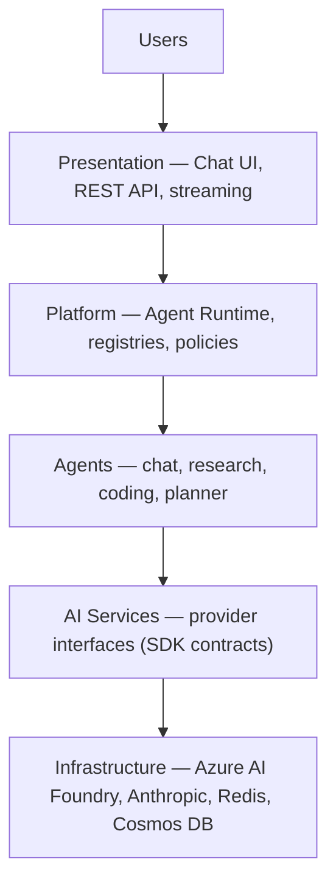

# Enterprise Multi-Agent AI Platform

A provider-agnostic, cloud-native platform for hosting multiple collaborating AI
agents.

This is **not a chatbot**. It is a reusable platform in which agents, LLM
providers, memory, tools, search, embeddings and vector stores are each
independently replaceable through configuration, without touching business logic.

---

## Status

| | |
| --- | --- |
| **Current milestone** | **01 — Repository Foundation** ✅ Complete |
| **Next milestone** | 01.5 — Developer Experience |
| **Agents / models / tools registered** | None. Milestone 01 is deliberately free of AI functionality. |

Milestone 01 delivers the runtime, configuration, observability and delivery
pipeline that every later milestone is built on. See
[`docs/milestones/`](docs/milestones/) for the full roadmap.

---

## Quick start

**Prerequisites:** Docker Desktop, and — for running outside containers —
[uv](https://docs.astral.sh/uv/) and Node.js 20+.

```bash
git clone <repository-url>
cd multi-agent-ai-platform
cp .env.example .env

docker compose up --build
```

| | |
| --- | --- |
| Frontend | <http://localhost:5173> |
| Backend | <http://localhost:8000> |
| API docs | <http://localhost:8000/docs> |
| Health | <http://localhost:8000/health> |

Both services hot reload on source changes. If port 8000 or 5173 is already
taken, set `BACKEND_PORT` and `FRONTEND_PORT` in `.env`.

Running without Docker, plus IDE and debugger setup, is covered in
[`docs/developer-setup.md`](docs/developer-setup.md).

---

## Architecture

Five layers. Each depends only on the one below it, and business logic never
depends on infrastructure.



The boundary that matters is between **AI Services** and **Infrastructure**.
Everything above the line depends on interfaces in `agent_platform_sdk`;
implementations live in `agent_platform.providers`, the only package permitted to
import a vendor SDK. That is what makes a provider swap a configuration change.

Full design: [`.claude/architecture.md`](.claude/architecture.md).

### Repository layout

```
multi-agent-ai-platform/
├── .claude/          Authoritative product, architecture and AI guidance
├── .github/          CI workflows, Dependabot, PR template
├── docs/             ADRs, engineering handbook, milestones, setup guide
├── docker/           Dockerfiles and nginx configuration
├── infra/            Bicep templates and azd scaffold
├── prompts/          Versioned prompt assets (populated in Milestone 03)
├── src/
│   ├── backend/      agent_platform        — FastAPI app and agent runtime
│   ├── sdk/          agent_platform_sdk    — interfaces, DTOs, events, policies
│   ├── shared/       agent_platform_shared — correlation, clock, identifiers
│   └── frontend/     React 19 platform portal
├── tests/            Unit and integration tests, mirroring the source tree
└── tools/            Developer tooling
```

Python dependency direction is one-way and enforced by the package manifests:

```
agent_platform  →  agent_platform_sdk  →  agent_platform_shared
```

---

## What Milestone 01 delivers

**Backend** — FastAPI application factory; strongly typed configuration
validated at startup; `dependency-injector` composition root; structlog JSON
logging; OpenTelemetry tracing; `/live`, `/ready` and `/health`; a platform
exception hierarchy mapped to a single HTTP error envelope.

**SDK** — every provider contract named in `CLAUDE.md`, declared as
`typing.Protocol`: `LLMProvider`, `MemoryProvider`, `ToolProvider`,
`SearchProvider`, `EmbeddingProvider`, `VectorStoreProvider`, `PromptProvider`,
`EvaluationProvider`, plus DTOs, runtime events and budget/retry/timeout
policies.

**Frontend** — React 19 + TypeScript + Vite + Tailwind v4 portal shell; a
centralised API client with correlation IDs, timeouts and normalised errors;
TanStack Query; runtime-validated responses.

**Delivery** — multi-stage non-root Dockerfiles; Compose with hot reload on both
services; GitHub Actions running every quality gate; azd and Bicep scaffold.

Not in scope, by design: LLM integration, LangGraph workflows, chat, memory,
search, and production deployment. Each has its own milestone.

### Observability

Every request generates a correlation ID, propagated through the API, runtime,
providers, logs and traces, and returned in `X-Correlation-ID`. Every log record
carries `correlation_id`, `request_id`, `trace_id` and `span_id` automatically —
no call site passes them:

```json
{
  "event": "http.request_completed",
  "http_method": "GET",
  "http_path": "/api/v1/info",
  "http_status": 200,
  "latency_ms": 1.42,
  "correlation_id": "e7a43d64-63d6-4039-8199-a3960758df49",
  "request_id": "e5346a7a-25ab-49f8-8c32-eb66cbd9008c",
  "trace_id": "c23311d9ee9f8e32b184134abab66e33",
  "span_id": "3cd3016e197f1b1e",
  "level": "info",
  "timestamp": "2026-08-08T02:23:01.781187Z"
}
```

Instrumentation is vendor-neutral OpenTelemetry; Azure Monitor is reached through
a collector rather than an SDK compiled into the application
([ADR-0005](docs/adr/0005-opentelemetry-first-observability.md)).

---

## Quality gates

No failing gate may be ignored. CI runs all of them on every pull request.

```bash
# Backend
uv run ruff check .        # lint
uv run black --check .     # format
uv run mypy                # strict type check
uv run pytest              # tests

# Frontend
cd src/frontend
npm run lint               # ESLint, type-aware
npm run format:check       # Prettier
npm run typecheck          # TypeScript, all strict flags
npm test                   # Vitest
npm run build              # production bundle

# Containers
docker build -f docker/backend.Dockerfile  --target production .
docker build -f docker/frontend.Dockerfile --target production .
```

---

## Configuration

Nothing is hardcoded. Every value is externalised, strongly typed and validated
once at startup; invalid configuration prevents the application from starting.

Nested settings bind from `PLATFORM_<SECTION>__<FIELD>`, for example
`PLATFORM_SERVER__PORT`. See [`.env.example`](.env.example) for the full surface
and [ADR-0002](docs/adr/0002-typed-configuration-and-fail-fast-startup.md) for
why it works this way.

Configurations that are unsafe for a production-like environment — `debug=true`,
console log rendering, a wildcard CORS origin — are rejected at startup rather
than deployed.

**Secrets** live in a git-ignored `.env` locally and in Azure Key Vault in Azure.
Azure services are reached with `DefaultAzureCredential`: `az login` locally,
Managed Identity in Azure, with no code difference between them.

---

## Documentation

| Document | Purpose |
| --- | --- |
| [`.claude/CLAUDE.md`](.claude/CLAUDE.md) | Engineering rules and platform principles |
| [`.claude/project-spec.md`](.claude/project-spec.md) | Product requirements |
| [`.claude/architecture.md`](.claude/architecture.md) | Architecture design document |
| [`docs/user-guide/`](docs/user-guide/) | Building a business solution on the platform |
| [`docs/engineering-handbook.md`](docs/engineering-handbook.md) | Backend, frontend and DevOps standards |
| [`docs/adr/`](docs/adr/) | Architecture Decision Records |
| [`docs/milestones/`](docs/milestones/) | Milestone definitions and status |
| [`docs/developer-setup.md`](docs/developer-setup.md) | Local development guide |
| [`infra/README.md`](infra/README.md) | Infrastructure design and status |

These documents are the single source of truth. If an implementation request
conflicts with them, the conflict is raised and resolved before code is written —
architecture is never changed silently.

---

## Contributing

Read [`docs/engineering-handbook.md`](docs/engineering-handbook.md) first.

Branches follow `feature/<name>`, `fix/<name>`, `docs/<topic>`,
`refactor/<component>`, `infra/<component>`. Every pull request must satisfy the
Definition of Done in the PR template; any decision that is expensive to reverse
needs an ADR.
