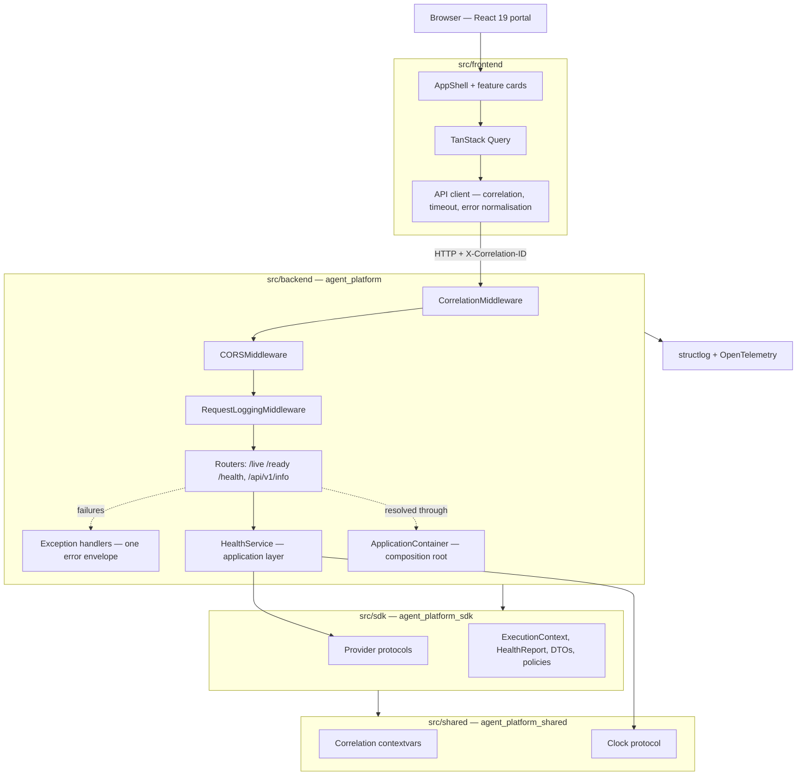
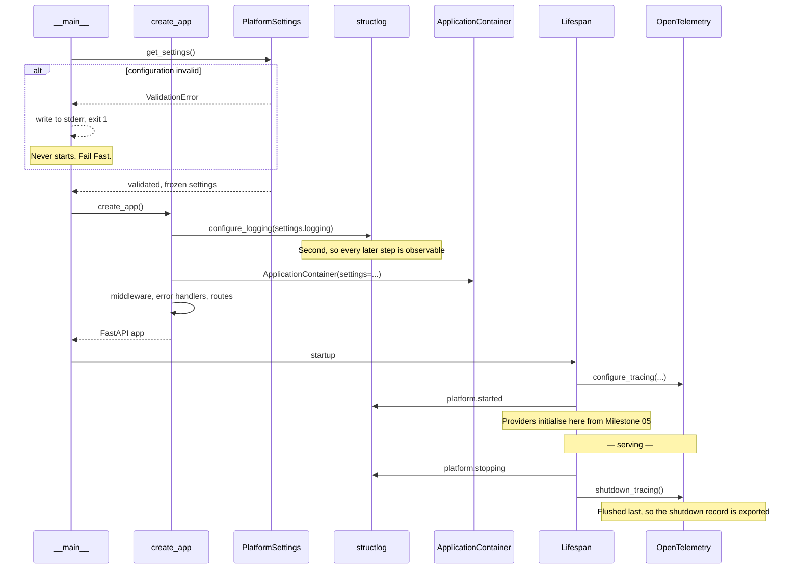
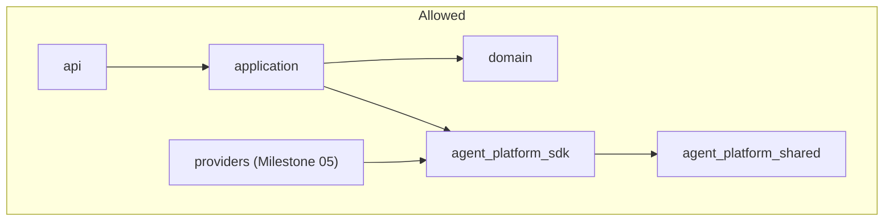
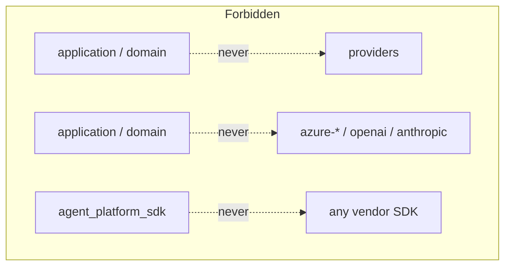
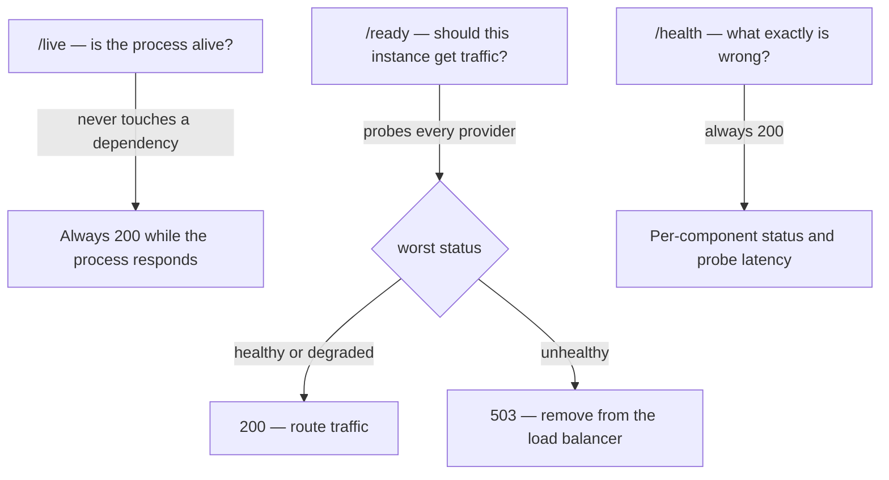
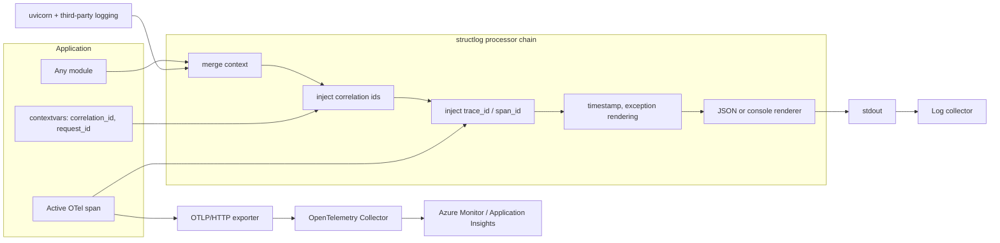

# Milestone 01 — Foundation architecture

**Scope:** the repository foundation. No LLM functionality, no agents, no tools.
**Date:** 2026-08-08

This describes what Milestone 01 actually built and how the pieces fit together.
For the full target architecture, see
[`.claude/architecture.md`](../../.claude/architecture.md).

---

## 1. What exists today



Solid arrows are calls; dotted arrows are dependency resolution.

**No provider is registered.** `HealthService` accepts a tuple of `Provider` and
receives an empty one. When Milestone 05 registers Azure AI Foundry, it becomes
probeable without `HealthService` changing — that is the abstraction working.

---

## 2. Startup sequence

Ordered so that failures surface as early as possible, and so that every step
after the first is observable.



Configuration is validated **before** logging is configured, which is why the
failure path writes to stderr: the logger is configured from the very settings
that failed to load.

---

## 3. Request lifecycle

```mermaid
sequenceDiagram
    participant Client as API client
    participant CM as CorrelationMiddleware
    participant CORS as CORSMiddleware
    participant RL as RequestLoggingMiddleware
    participant Route as Route handler
    participant Dep as Dependency providers
    participant Svc as HealthService
    participant EH as Exception handlers

    Client->>CM: GET /health  (X-Correlation-ID optional)
    CM->>CM: honour inbound id or generate; always generate request id
    CM->>CM: bind to contextvars + log context
    CM->>CORS: forward
    CORS->>RL: forward
    RL->>RL: start monotonic timer
    RL->>Route: forward

    Route->>Dep: resolve HealthService from app.state.container
    Dep-->>Route: instance
    Route->>Svc: check()
    Svc->>Svc: span health.check; probe each provider
    Svc-->>Route: HealthReport

    alt handler raises
        Route->>EH: exception
        EH->>EH: log full diagnostics internally
        EH-->>RL: error envelope, no stack trace
    else success
        Route-->>RL: response
    end

    RL->>RL: emit http.request_completed with latency
    RL-->>CM: response
    CM->>CM: clear log context, restore contextvars
    CM-->>Client: response + X-Correlation-ID, X-Request-ID
```

**Middleware order.** Starlette applies middleware in reverse registration
order, so `CorrelationMiddleware` is registered last and runs outermost. That
guarantees every record — including CORS rejections and unhandled errors —
carries a correlation ID.

**Probes are not access-logged.** Orchestrators poll `/live` and `/ready` every
few seconds; logging them would bury real traffic and cost real money in
ingestion.

---

## 4. Dependency direction

The rule the whole architecture rests on: **business logic never depends on
infrastructure**.





`providers` depends on the SDK; nothing depends on `providers`. Implementations
reach business logic only by being injected through the container.

**How this is enforced, not merely documented:**

| Mechanism | Catches |
| --- | --- |
| Separate distributions with one-way manifests | A layering violation fails dependency resolution |
| Ruff `ban-relative-imports = "all"` | Hidden cross-layer imports; every import states its package |
| `mypy --strict` across all three packages | Contract mismatches at the point of registration |
| SDK README + review checklist | A vendor SDK creeping into the contract layer |

---

## 5. Health model

Three endpoints because orchestrators need three different answers. Conflating
them causes real outages.



- **`/live` ignores dependencies on purpose.** A liveness probe that checks a
  downstream service will restart a healthy container because something *else*
  is down, turning one outage into two.
- **Degraded still serves.** A partially working instance beats no instance, and
  the degradation stays visible on `/health` and in the logs.
- **`/health` always returns 200.** The payload carries the verdict, so a
  monitoring system can tell "the platform reports itself unhealthy" apart from
  "the platform did not answer".
- **A raising provider is reported, not propagated.** One broken dependency must
  not break the endpoint whose job is to say which dependency is broken. Only the
  exception *type* is returned — a message could carry an endpoint or a
  credential fragment.

---

## 6. Observability



Two properties do the work:

**No call site passes an identifier.** Correlation IDs and trace context are
injected by processors. The code that forgets to pass an ID is always the code
logging the failure you are trying to diagnose.

**Third-party records join the same stream.** uvicorn and library logging are
routed through the same chain, so the whole output has one shape rather than
structured JSON interleaved with free text.

Azure is reached through a collector, not an SDK compiled into the application —
see [ADR-0005](../adr/0005-opentelemetry-first-observability.md).

---

## 7. Where the next milestones plug in

Every extension point already exists. None requires changing what Milestone 01
built.

| Milestone | Adds | Plugs into |
| --- | --- | --- |
| 02 — Chat UI, session memory | Chat routes, `MemoryProvider` (in-memory) | New router in `api/v1/router.py`; memory registered in the container |
| 03 — Agent runtime | LangGraph workflows, chat agent, registries | `runtime/`, `workflow/`, `agents/`, `registries/` skeletons |
| 04 — Tool framework | Internet search, tool registry | `ToolProvider` protocol; `tools/` skeleton |
| 05 — Azure AI Foundry | Gemma 4 via managed compute | `LLMProvider` protocol; `providers/` skeleton; providers initialise in the lifespan |
| 06 — Infrastructure | Container Apps, full `azd up` | `infra/bicep`, `azure.yaml` |
| 07 — CI/CD | Deployment pipelines | `.github/workflows` |
| 08 — Hardening | Persistence, dashboards, budgets | `storage/`, `evaluation/`, `BudgetPolicy` |

The test that this is real: adding an LLM provider in Milestone 05 requires
implementing `LLMProvider`, registering it in the container, and adding
configuration. No existing agent, route or service changes.
