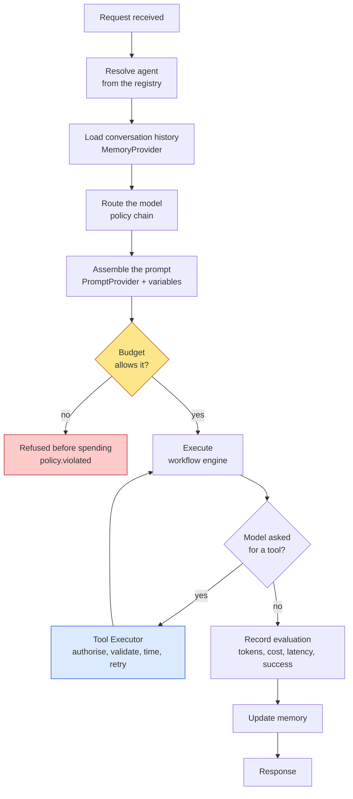
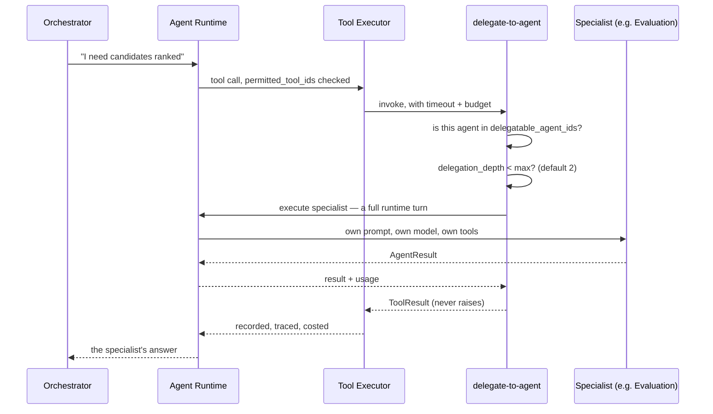

# Agent design guide

For developers about to add or change an agent. Contracts, patterns,
anti-patterns and a design template — all against the code as it exists.

Running example: **Internal Fitments** ([reference](./internal-fitments-reference.md)).

---

## 1. What an agent is here

> An agent reasons within its assigned domain and does nothing else.
> Everything around that — memory, prompt resolution, model selection, tool
> execution, retries, budgets, telemetry — belongs to the runtime.
>
> — [`interfaces/agent.py`](../../src/sdk/agent_platform_sdk/interfaces/agent.py)

The contract is three members:

```python
@runtime_checkable
class Agent(Protocol):
    @property
    def descriptor(self) -> AgentDescriptor: ...
    async def execute(self, request: AgentRequest, context: ExecutionContext) -> AgentResult: ...
    def stream(self, request: AgentRequest, context: ExecutionContext) -> AsyncIterator[CompletionChunk]: ...
```

### What an agent must not do

Stated in the contract's own docstring. An agent must not:

- import a provider, or name one
- read a prompt file, or hold a prompt string
- load or write conversation memory
- call another agent
- apply a retry or timeout policy of its own

Each of those, done inside an agent, is done *once per agent* — so the second
agent either copies it or quietly differs. That is what makes a God Agent, and it
starts with one convenience.

The single dependency an agent legitimately has is the `LLMGateway`, because
producing text is its job. Even that is the gateway, never a provider.

### You will almost certainly not write one

`ChatAgent` is generic. It builds a completion from the request, calls the
gateway, and returns the result. An agent's *behaviour* lives in its descriptor
and its prompt, so a specialist is **configuration plus a prompt asset**.

Write a new `Agent` implementation only if the reasoning loop itself differs —
not because the domain differs.

---

## 2. The agent contract (the "agent card")

The briefing describes each agent publishing a machine-readable card: its name,
its exact skills, and the shape of the task it accepts. Here that is
[`AgentDescriptor`](../../src/sdk/agent_platform_sdk/dto/agent.py), published at
`GET /api/v1/agents`.

| Field | Type | Meaning |
| --- | --- | --- |
| `agent_id` | `str` | Stable identifier |
| `name`, `description` | `str` | Human-readable. `description` is what a coordinator's delegation prompt shows |
| `version`, `owner` | `str`, `str \| None` | Accountability |
| `provider_id`, `model_id` | `str` | Defaults, resolved through the registries. Never an import |
| `temperature`, `max_output_tokens` | `float \| None`, `int \| None` | `None` means "the provider's default" — **zero is a real value**, not "unset" |
| `prompt_id`, `prompt_version` | `str`, `str \| None` | Prompt asset. `None` selects the newest **by lexicographic sort**, so `'1.10'` ranks *below* `'1.9'` ([`file_prompt_provider.py:287`](../../src/backend/agent_platform/prompts/file_prompt_provider.py#L287)). Zero-pad or pin |
| `tool_ids` | `tuple[str, ...]` | **The permission boundary.** A model may emit any tool name; only these are executed — but the check is skipped when the list passed to the executor is empty, so a custom caller must pass it explicitly ([tool guide §1](./tool-development-guide.md#two-guarantees-to-build-against)) |
| `memory_provider_id`, `search_provider_id` | `str \| None` | Overrides |
| `embedding_provider_id`, `vector_store_id` | `str \| None` | Declared *Future* — nothing reads them |
| `budget` | `BudgetPolicy` | `max_total_tokens`, `max_cost`, `max_tool_invocations`, `max_model_calls` |
| `timeout` | `TimeoutPolicy` | `request_seconds`, `model_call_seconds`, `tool_call_seconds`, `first_token_seconds` |
| `retry` | `RetryPolicy` | `max_attempts`, backoff, `jitter`, `retryable_categories` |
| `guardrails` | `tuple[str, ...]` | Declared *Future* — **not enforced** |
| `is_enabled` | `bool` | Disable an agent by configuration alone |

### What it does not carry

**No input or output schema.** The briefing's card declares "the shape of the
task it accepts"; the descriptor does not. Input and output schemas exist on
*tools*, not agents. **Not implemented — platform gap.**

Practically, this means a coordinator learns what a specialist accepts from the
`description` text in the delegation tool's schema, in prose. That works and it
is not checkable. If you need a machine-checkable agent input contract, define it
on a tool the specialist owns and validate there.

### What the runtime gives you around it

The agent lifecycle, read out of
[`agent_runtime.py`](../../src/backend/agent_platform/runtime/agent_runtime.py),
in order, per turn:



**You get every one of those stages by registering a descriptor.** Each emits
events and spans carrying the correlation id, and the evaluation record is
written whether the turn succeeded, failed or was abandoned.

Two stages are worth noticing because they are where design mistakes surface.
**Budget** is checked before the model is called and again between tool
iterations — the only two moments where refusing still saves money. **Tool
execution** is a loop, so an agent with tools costs at least two model calls on
any turn that uses one.

### How one agent reaches another

The briefing's A2A flow, as this platform implements it. The rule from
`CLAUDE.md` is that agents never call each other directly:



Everything the runtime does for a user request — authorisation, timeout, retry,
telemetry, budget — it therefore also does for a handoff. That is the entire
argument for making delegation a tool rather than a second mechanism.

Note what is **not** here: no queue, no task envelope, no idempotency key. The
call is synchronous and caller-driven. See
[the reference](./internal-fitments-reference.md#3-agent-to-agent-communication-a2a)
for what that costs and how to work with it.

---

## 3. When to create an agent

**Create one when at least two hold:**

| Criterion | Internal Fitments example |
| --- | --- |
| Different responsibility | Evaluation ranks; Scheduling books |
| Different tools | Scheduling needs the interviewer roster; Reporting needs read-only queries |
| Different model needs | Evaluation needs long context and reasoning; Monitoring needs cheap |
| Different permissions | Only Notification may send to Slack |
| Different lifecycle | Monitoring is continuous; the rest are request-driven |
| Different evaluation criteria | Ranking quality versus scheduling conflict rate |
| Can operate independently | Any of the six could be its own service |
| Separation improves maintainability | *A scheduling bug can't corrupt an evaluation* |

**Do not create one when:**

- Only the prompt differs — that is a mode, not an agent
- It would only ever be called by one other agent, with no independent
  evaluation — that is a **tool**
- It has no reasoning to do — see below

> **The test worth applying hardest.** If the "agent" formats a message and calls
> an API, it is a tool. A model in that path adds latency, cost and a failure
> mode, and removes determinism. The Notification Agent is the honest case to
> examine: as *the single door out with a dedupe log*, its value is the boundary,
> not the reasoning — so implement the boundary as a tool and let the agents that
> need it declare it.

---

## 4. Adding an agent, concretely

Three files. No new class.

### 4.1 The prompt asset

A Markdown file with YAML front matter, anywhere under `prompts/` — the format
used by
[`prompts/agents/research/system.md`](../../prompts/agents/research/system.md).
Follow the existing convention and put it at
`prompts/agents/<name>/system.md`:

```markdown
---
prompt_id: evaluation-agent-system
version: '1.0'
owner: staffing-solution-team
description: System prompt for the candidate evaluation specialist.
variables:
  - name: locale
    description: BCP 47 locale the response should be written in.
    required: false
compatible_models:
  - fw-kimi-k3
updated_at: 2026-08-10T00:00:00Z
---

You are a candidate evaluation specialist. ...
```

**The path is a convention; the front matter is the contract.** The provider
`rglob`s `*.md` under the prompt root and keys every asset by its declared
`prompt_id` and `version` — so the folder name is for humans, and an agent finds
its prompt by `prompt_id` alone. Two consequences worth knowing: a file with no
`prompt_id` or no `version` **stops startup**, and two files declaring the same
pair also stop startup rather than one silently winning. (`readme.md` is exempt
by name, which is why `prompts/README.md` is fine.) (Note the existing
folders are `chat` and `research` while the agent ids are `chat-agent` and
`research-agent` — more evidence the directory is decoration.)

Prompts are **versioned assets, not strings in Python** (`CLAUDE.md`). This is
not bureaucracy: changing the reference chat agent's behaviour so it would search
proactively was a prompt version bump and *no code change at all*.

### 4.2 The settings block

Follow [`ResearchAgentSettings`](../../src/backend/agent_platform/configuration/settings.py)
— `enabled`, `agent_id`, `prompt_id`, `prompt_version`, `provider_id`,
`model_id`, `temperature`, `max_output_tokens`, `tool_ids`,
`max_tool_invocations`, `max_model_calls`.

**Then add a field for it on `PlatformSettings`** — the list at the bottom of
`settings.py`, beside `research_agent`. This step is easy to miss and fails
loudly: the root model is `extra="forbid"`, so a `PLATFORM_EVALUATION_AGENT__*`
variable with no matching field **stops startup** rather than being ignored.
That is the right behaviour and a baffling first error if you were not expecting
it.

Two traps `ResearchAgentSettings` already encodes:

- **`tool_ids` needs `Annotated[tuple[str, ...], NoDecode]`.** For a collection
  field, `pydantic-settings` runs `json.loads` on the raw environment value
  *before* any validator, so a comma-separated list raises `SettingsError` at
  startup. This has been hit three times in this repository. (Note `PLATFORM_MCP__SERVERS`
  carries `NoDecode` for the opposite reason — it really is JSON. Do not
  generalise from one to the other.)
- **Empty `provider_id`/`model_id` should inherit** the primary agent's. Setting
  them is how one agent uses a cheaper or stronger model.

**Delegation configuration has no home yet.** `delegatable_agent_ids` and
`max_delegation_depth` are constructor arguments to `DelegateToAgentTool`
([`delegate_tool.py:73-74`](../../src/backend/agent_platform/tools/delegate_tool.py#L73-L74)),
fed today from `PLATFORM_RESEARCH_AGENT__MAX_DELEGATION_DEPTH` — i.e. the
delegation policy is bolted to one agent's settings block. A coordinator with its
own delegatable set has nowhere to declare it. That is a platform change, listed
with the others in
[§14 of the solution guide](./developer-solution-guide.md#the-platform-changes-internal-fitments-would-need).

### 4.3 The registry entry

In `build_agent_registry()`
([`container.py`](../../src/backend/agent_platform/dependencies/container.py)):

```python
if settings.evaluation_agent.enabled:
    evaluation = settings.evaluation_agent
    descriptor = AgentDescriptor(
        agent_id=evaluation.agent_id,
        name="Evaluation Agent",
        description="Ranks candidates against a job description, with reasoning.",
        provider_id=evaluation.provider_id or settings.agent.provider_id,
        model_id=evaluation.model_id or settings.agent.model_id,
        prompt_id=evaluation.prompt_id,
        prompt_version=evaluation.prompt_version,
        temperature=evaluation.temperature,
        max_output_tokens=evaluation.max_output_tokens,
        tool_ids=evaluation.tool_ids,
        budget=BudgetPolicy(
            max_tool_invocations=evaluation.max_tool_invocations,
            max_model_calls=evaluation.max_model_calls,
        ),
    )
    registry.register(descriptor.agent_id, ChatAgent(descriptor, gateway))
```

Then `.env.example` (a test asserts it matches the settings model) and
`infra/bicep/main.parameters.json` if it must be settable in Azure — **a
parameter missing there silently takes its Bicep default.**

Startup validation refuses to boot if an agent names a model no provider serves.

> **Known gap.** Agents are registered in Python, from settings blocks.
> `architecture.md` §17 calls for a registry loaded from YAML descriptors, and
> the code itself says one "replaces it once there is more than one agent to
> declare" — there are already two. For a six-agent solution, build that registry
> first. It is a genuine platform change and deserves an ADR.

---

## 5. Design template

Fill this in before writing anything. Fields map to what actually exists; the
starred ones have no platform enforcement and are design intent you must uphold
yourself.

> **This YAML is a design worksheet, not a configuration format.** The platform
> does not read it. Agents are configured today as **typed settings blocks bound
> from the environment** and registered in `build_agent_registry()` — see the
> translation below the template. The worksheet exists because the descriptor has
> nowhere to put purpose, boundaries, completion criteria or error states, and
> those are the fields that decide whether the agent is well-drawn.

Two rows deserve their warning up front, because both look like platform
features and are not:

**`required_capabilities` is not a field on `AgentDescriptor`.** The runtime
derives what a turn requires, and derives exactly one thing: `TOOL_CALLING`, when
`tool_ids` is non-empty
([`agent_runtime.py:468-470`](../../src/backend/agent_platform/runtime/agent_runtime.py#L468-L470)).
You cannot make `structured_output` a routing constraint. Combined with
`response_format` being carried but read by no provider, **an agent that needs
structured output has no platform support at any layer** — not routing, not the
request, not parsing. Say it in the prompt, parse and validate the JSON
yourself, and treat a parse failure as a real outcome.

**`memory` is the caller's decision, not the agent's.** `memory_provider_id`
picks *which* store; nothing picks *whether*. History loads whenever the turn
carries a `conversation_id`
([`agent_runtime.py:504-519`](../../src/backend/agent_platform/runtime/agent_runtime.py#L504-L519)).
An agent that should not see conversation history is one you invoke without a
`conversation_id` — which is exactly what delegation does.

```yaml
agent:
  id:                     # AgentDescriptor.agent_id
  name:
  description:            # what a coordinator sees when deciding to delegate
  owner:
  version:

  purpose:                # * one sentence. if it needs "and", consider two agents
  responsibility:         # * what it owns end to end
  not_responsible_for:    # * the boundary, written down

  inputs:                 # * prose today — no schema on the descriptor
  outputs:                # * ditto. enforce via a tool's output_schema if it matters
  completion_criteria:    # * when is this agent done?
  error_states:           # * what can it fail at, and what should the caller do?

  provider_id:            # empty inherits the primary agent's
  model_id:
  temperature:            # None = provider default. 0 is a real value
  max_output_tokens:
  required_capabilities:  # * NOT a descriptor field. see the note below —
                          #   routing derives TOOL_CALLING and nothing else

  prompt_id:
  prompt_version:         # pin for reproducibility

  tool_ids: []            # the real permission boundary

  memory:                 # * the CALLER's choice, not the agent's. see below
  business_state:         # * which records it reads/writes, via which tools

  budget:
    max_total_tokens:
    max_cost:
    max_tool_invocations:
    max_model_calls:
  timeout:
    request_seconds:
    model_call_seconds:
    tool_call_seconds:

  triggers:               # * user request | delegation | external scheduler
  handoffs:               # * which agents it may delegate to (delegatable_agent_ids)
  human_approval:         # * which gates follow it — YOU implement these
  guardrails:             # * prompt-level. descriptor.guardrails is not enforced

  evaluation:             # * golden set, criteria, override rate
  observability:          # * business events beyond the platform's own
```

### Worked: the Evaluation Agent

```yaml
agent:
  id: evaluation-agent
  name: Evaluation Agent
  description: >
    Ranks candidates against a job description and explains each ranking.
    Give it a staff request id; it returns ranked candidates with strengths,
    gaps and a rationale per candidate.
  owner: staffing-solution-team

  purpose: Produce a ranked, explained shortlist a PM can approve or reject.
  responsibility: Reading the JD and CVs, scoring, and writing the rationale.
  not_responsible_for: >
    Deciding who progresses (gate one, a human), scheduling, notifying.

  inputs: staff_request_id
  outputs: ranked candidates; each with score, strengths, gaps, rationale
  completion_criteria: every candidate in the pool has a rank and a rationale
  error_states: >
    unreadable CV (skip, report which); no candidates (return empty, do not
    invent); JD missing (fail loudly — ranking without criteria is noise)

  model_id: <long-context reasoning model>
  temperature: 0.1            # ranking should be near-reproducible
  required_capabilities: [structured_output]   # * aspiration only — unenforceable.
                                               #   pick the model deliberately instead

  prompt_id: evaluation-agent-system
  prompt_version: '1.0'       # pinned: a prompt change changes every ranking

  tool_ids:
    - staff-request-documents  # you build this
    - staff-request-write      # you build this

  memory: none                # * achieved by calling it WITHOUT a conversation_id,
                              #   as delegation does — not by configuration
  business_state: reads Staff Request + candidates; writes the ranking

  budget:
    max_model_calls: 2
    max_tool_invocations: 4

  triggers: JD/CV upload, via your solution API
  handoffs: none — it returns to the Orchestrator
  human_approval: gate one follows immediately
  guardrails: >
    Never invent a candidate. Never score on protected characteristics.
    Say "insufficient information" rather than guessing.

  evaluation: golden set of 20 JD/CV sets with expert rankings; PM override rate
  observability: ranking produced, candidate count, reuse-vs-recompute
```

Two decisions in there are worth copying: **pin the prompt version** (an
unpinned prompt means last month's shortlist is not reproducible), and
**`temperature: 0.1`** (`None` would take the provider default, and a ranking
that changes between runs is one nobody trusts).

### What the worksheet turns into

The rows the platform actually reads become a settings block bound from the
environment — the same shape as the shipped research agent, which is the pattern
to copy:

```bash
PLATFORM_EVALUATION_AGENT__ENABLED=true
PLATFORM_EVALUATION_AGENT__AGENT_ID=evaluation-agent
PLATFORM_EVALUATION_AGENT__PROVIDER_ID=azure-foundry
PLATFORM_EVALUATION_AGENT__MODEL_ID=<your long-context model>
PLATFORM_EVALUATION_AGENT__PROMPT_ID=evaluation-agent-system
PLATFORM_EVALUATION_AGENT__PROMPT_VERSION=1.0
PLATFORM_EVALUATION_AGENT__TEMPERATURE=0.1
PLATFORM_EVALUATION_AGENT__TOOL_IDS=staff-request-documents,staff-request-write
PLATFORM_EVALUATION_AGENT__MAX_MODEL_CALLS=2
PLATFORM_EVALUATION_AGENT__MAX_TOOL_INVOCATIONS=4
```

plus a settings class beside `ResearchAgentSettings` in
[`configuration/settings.py`](../../src/backend/agent_platform/configuration/settings.py),
a prompt asset at `prompts/agents/evaluation-agent/`, and a registration in
`build_agent_registry()`. Add every new variable to `.env.example` — a test
asserts the two agree.

The starred worksheet rows have nowhere to go. Keep them in the solution's own
design docs and in the agent's prompt, which is where `not_responsible_for` and
`error_states` actually take effect.

---

## 6. Patterns

### 6.1 Orchestrator

Owns status and dispatch; performs no specialist work.
**Platform:** an agent with `delegate-to-agent` in its `tool_ids` and its
delegatable set configured.
**Use when** several specialists must be coordinated and someone needs one place
to ask.
**Do not** let it acquire specialist tools "just for now". That is how it becomes
the God Agent.

### 6.2 Specialist agent

One narrow job end to end.
**Platform:** descriptor + prompt.
**Use when** §3 says so. **Do not** for a prompt variation.

### 6.3 Sequential chain

A → B → C, each starting when the last finishes.
**Platform:** delegation is synchronous and caller-driven. There is **no task
envelope and no queue** — only `LoggingEventPublisher` exists.
**So:** drive the chain from *state* in your own orchestration code, not by
agents handing off asynchronously. A short chain can also be one coordinator
delegating twice, within the depth limit.

### 6.4 Human decision gate

**Platform: not implemented.** Terminal state plus separate resumption trigger —
see [the guide's §8](./developer-solution-guide.md#8-human-in-the-loop).
**Never** hold a turn open.

### 6.5 Tool-using agent

**Platform:** fully implemented — the loop is in the workflow layer and shared by
both engines, so it applies to streaming as well as non-streaming.
**Bound it:** `max_tool_invocations` and `max_model_calls` are checked *between*
iterations, where stopping still saves the next call.

### 6.6 Background monitoring agent

**Platform: not implemented** — no scheduler, no background execution.
**Do:** external trigger → your API → query state → run the agent per item.
**Do not** poll with a model. An SLA check is a database query; invoke a model
only when there is something to say.

### 6.7 Notification gateway

One agent or tool is the only path to a channel.
**Platform:** enforced structurally by which agents declare the tool.
`required_permissions` is **not enforced**.
**Requires** a dedupe log keyed by (event, recipient) — otherwise "the single
door" still sends twice on a retry.

### 6.8 Read-only reporting agent

Aggregates and answers questions; writes nothing.
**Platform:** an agent whose tools are all queries.
**Enforce read-only in the tool**, not the prompt. A prompt is not an access
control.

### 6.9 Shared state

One system of record; agents read and write via tools.
**Platform: you build it.** `storage/` is empty.

### 6.10 Agent contract

**Platform:** `AgentDescriptor` + tool schemas, published at `/api/v1/agents` and
`/api/v1/tools`. No agent-level input/output schema.

### 6.11 Idempotent action

**Platform: not implemented.** Key inside your tool's arguments, deduplicated in
your store. Derive the key from business identity so a retrying model cannot
invent a second one.

---

## 7. Anti-patterns

| Anti-pattern | Why it hurts | Internal Fitments form |
| --- | --- | --- |
| **One giant agent** | One prompt covering six jobs is worse at all six; one bug breaks everything | An "Account Staffing Agent" that evaluates, schedules, monitors and notifies |
| **Overlapping responsibilities** | Two agents that both update status produce two truths | Scheduling *and* Monitoring both marking an interview complete |
| **Every agent has every tool** | The permission boundary disappears; any agent can Slack anyone | Giving `send_notification` to all six |
| **Agents making business decisions** | Nobody is accountable for a wrong call | Auto-approving the shortlist because ranking was confident |
| **Uncontrolled side effects** | Duplicate invites, duplicate messages | `schedule_interview` with no idempotency key |
| **No state model** | Status becomes something you produce, not something that is true | Reconstructing candidate status from a chat log |
| **No agent contract** | Callers guess; a change breaks them silently | Only humans know what the Evaluation Agent returns |
| **No idempotency** | One retry double-books a real person | The bug the briefing designed against |
| **No audit trail** | An override cannot be explained afterwards | A Service Line Leader override with no record |
| **Hardcoded model** | Changing vendor becomes a code change | `model_id="fw-kimi-k3"` in Python. `CLAUDE.md` forbids it |
| **Provider-specific business logic** | Couples the solution to one vendor | Catching an Azure SDK exception in an agent |
| **Chatty agent-to-agent traffic** | Each hop is a model call, latency and cost | Orchestrator asking Reporting for something it already holds |
| **Infinite agent loops** | Unbounded cost | A delegates to B delegates to A — guarded at depth 2 |
| **Excessive background polling** | Constant spend for no information | An LLM call per minute per open invite |
| **Unbounded cost** | One request can cost anything | No `BudgetPolicy` |
| **Reports as the source of truth** | Status goes stale between reports | Deciding from yesterday's digest instead of live state |

---

## 8. Checklist before you write code

- [ ] The business process is drawn, with states and transitions
- [ ] Every decision is marked human or automated, with a reason
- [ ] Agent boundaries pass at least two criteria from §3
- [ ] Each agent's descriptor is filled in — including what it is *not* for
- [ ] Every tool has a JSON Schema and, if it writes, an idempotency key
- [ ] Models are chosen on capability, latency and cost — not by name
- [ ] Business state has an owner and a store
- [ ] Every gate is a terminal state plus a trigger, never a held turn
- [ ] Budgets are set on every agent
- [ ] Evaluation criteria are written before the agent is built

Full version: [development checklist](./agent-development-checklist.md).
