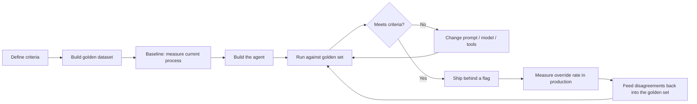

# Agent evaluation guide

How to know whether an agentic solution actually works — and what this platform
measures for you versus what you must build.

Running example: the **Evaluation Agent** from
[Internal Fitments](./internal-fitments-reference.md), which is the sharpest case
because *its* output is a judgement a human then reviews.

---

## 1. The distinction that matters

The platform measures **mechanics**. It does not measure **quality**.

| | Measures | Status |
| --- | --- | --- |
| **Mechanics** | Tokens, latency, cost, success/failure, retries, tool invocations, which model answered | **Implemented** — automatic, every turn |
| **Quality** | Is the ranking right? Was the interviewer a good match? Was the summary faithful? | **Not implemented — you build it** |

A green dashboard tells you the platform is healthy. It tells you nothing about
whether the Evaluation Agent ranked the right candidate first. Conflating the two
is the most common way an agentic solution ships broken and looks fine.

---

## 2. What you get for free

Every turn emits an
[`EvaluationRecord`](../../src/sdk/agent_platform_sdk/dto/evaluation.py):

| Group | Fields |
| --- | --- |
| Attribution | `correlation_id`, `request_id`, `conversation_id`, `session_id`, `agent_id` |
| Routing | `provider_id`, `model_id`, `deployment_name`, `prompt_version` |
| Timing | `occurred_at`, `latency_ms`, `time_to_first_token_ms` |
| Consumption | `usage` (prompt/completion/total tokens), `estimated_cost` |
| Outcome | `succeeded`, `streaming`, `retry_count`, `tool_invocations`, `error_category` |

Recorded to an `EvaluationProvider`. Two sinks are wired today — structured logs
and in-process cost analytics — behind a composite, so adding Application
Insights or Cosmos DB is *one line in a tuple*
([ADR-0016](../adr/0016-evaluation-records-and-cost-analytics.md)).

Four properties worth knowing before you design on top of it:

**Failed and abandoned turns are recorded.** Counting only successes flatters the
platform exactly when it is misbehaving — an incident where half of requests fail
would show unchanged cost and *improving* latency.

**Attribution follows the routing decision**, not the agent's configuration. With
policy routing those differ, and cost attributed to a model that did not answer
is worse than none: it is wrong in a way that looks right.

**`prompt_version` is on the record.** This is what makes "did prompt 1.2 rank
better than 1.1?" answerable at all. Pin prompt versions on agents whose output
you evaluate.

**No user content is recorded.** Counts, identifiers and money. If you need the
*content* of an evaluation to grade it, store it in your own system alongside
the correlation id.

### Reading it

```bash
curl https://<host>/api/v1/analytics/costs
```

Grouped by model, provider and agent. Two caveats stated by the endpoint itself:
totals are **per-process and reset on restart** (a live gauge, not a ledger — the
`scope` field says so), and **cost is an estimate from configured rates, never an
invoice**. An unpriced model contributes zero and therefore reads as free.

The durable ledger is the `evaluation.recorded` event in the structured log
stream, which survives restarts and covers every replica.

---

## 3. Evaluation-driven development

Write the evaluation criteria **before** the agent. If you cannot say what a good
output looks like, you cannot tell whether the prompt you are about to iterate on
made things better.



**"Ship behind a flag" means a flag you implement.** `FeatureFlagSettings`
declares five, and only `features.search` is read anywhere
([`container.py:284`](../../src/backend/agent_platform/dependencies/container.py#L284));
the rest are published by `/api/v1/info` and enforced nowhere. Copy the pattern —
gate the registration in `build_agent_registry()` or `build_tool_registry()` —
rather than adding a flag and assuming the platform honours it.

Step 3 is the one people skip. **Baseline the humans.** If two PMs shortlisting
the same pool agree only 70% of the time, an agent at 75% agreement with one of
them is doing well, and you would have called it a failure without the baseline.

---

## 4. Golden datasets

A golden dataset is a set of inputs with known-good outputs, curated by people
who are actually expert in the task.

For the Evaluation Agent:

| Element | Content |
| --- | --- |
| Input | A real JD plus a pool of real (anonymised) CVs |
| Expected output | An expert's ranking, plus which strengths and gaps they identified |
| Metadata | Who ranked it, when, how confident, and where they were unsure |
| Size | Start at 20 sets. Enough to see a change; small enough to curate honestly |

Four rules learned the hard way:

**Include the hard cases deliberately.** A near-tie between two candidates, a CV
with an employment gap, a candidate strong on skills and weak on domain. A golden
set of easy cases proves nothing and reports 95%.

**Include cases with no good answer.** A pool where nobody fits. An agent that
always produces a confident shortlist is worse than one that says "no candidate
here meets the requirement", and only an unanswerable case will catch it. This is
the same finding the RAG work produced with numbers: over the same corpus, an
unanswerable question scored *higher* than two genuine hits with the lexical
embedder. Retrieval accuracy separated the embedders modestly; **their ability to
say "there is nothing here" separated them completely.**

**Anonymise, and treat it as a data asset.** Real CVs are personal data. The
golden set is not a test fixture you commit next to the code.

**Record disagreement between experts.** Where two rankers disagree is exactly
where you should not penalise the agent for picking either.

---

## 5. Metrics

### Per-agent criteria

Different agents fail differently, so measure differently.

| Agent | Primary metric | Also track |
| --- | --- | --- |
| Evaluation | Rank correlation with expert ranking; top-3 overlap | **PM override rate**, rationale usefulness, cost per evaluation |
| Scheduling | Conflict-free booking rate | Invite acceptance rate, load balance across the panel, reschedules |
| Monitoring | SLA breaches detected / actual | False nudges, transcript summary faithfulness |
| Reporting | Answer accuracy against the state store | Scope leakage (**must be zero**), latency |
| Notification | Duplicate rate (**must be zero**) | Delivery success, wrong-recipient rate |
| Orchestrator | Correct agent chosen | Unnecessary delegations, status answer accuracy |

### The one metric to watch above all

**Human override rate at each gate.** It is the closest thing to ground truth a
production system produces, and it moves in an informative direction:

- **Rising** — the agent is drifting, or the population changed
- **Near zero** — either the agent is excellent, or nobody is really reviewing.
  Both are worth knowing, and they are indistinguishable from the number alone.
  Check time-to-decision alongside it: approvals in under five seconds are not
  reviews.

### Quality dimensions worth naming

| Dimension | For the Evaluation Agent |
| --- | --- |
| Correctness | Is the ranking defensible? |
| Faithfulness | Does the rationale reflect the CV, or is it invented? |
| Completeness | Was every candidate scored? |
| Consistency | Same input, same output? (Set `temperature` low and check) |
| Calibration | Does it say "insufficient information" when that is true? |
| Explainability | Can a PM act on the reasoning without reading the CV? |
| Safety | Does it ever score on a protected characteristic? |

The last one is not optional for a staffing solution and will not appear in any
platform metric.

---

## 6. Building an evaluation harness

**Not implemented — you build it.** The platform has no benchmarking runner. What
it gives you is everything needed to build one cheaply: executions are
independent, and every turn is measured automatically.

Note the harness must call `AgentRuntime` **in-process**, not over HTTP: the chat
API takes no `agent_id` and serves a single configured agent, so it cannot drive
a second agent's golden set. That is a constraint on the harness, not a problem
with it — running in-process is faster and cheaper anyway. Pass the agent's
`tool_ids` explicitly to any `ToolExecutor` you construct, since an empty list
disables the authorisation check.

The shape:

```python
async def evaluate_ranking(runtime: AgentRuntime, golden: GoldenSet) -> Report:
    results = []
    for case in golden.cases:
        context = ExecutionContext(session_id=f"eval-{case.id}")
        turn = await runtime.prepare(
            agent_id="evaluation-agent",
            user_input=case.prompt,
            context=context,
            # Pinning is a runtime parameter and deliberately not on the HTTP
            # API — choosing a model is choosing a bill. An offline harness is
            # exactly the caller it exists for.
            pinned_model_id=case.model_id,
        )
        result = await runtime.execute(turn)
        results.append(score(case.expected, parse(result.message.content)))
    return Report(results)
```

Three design points:

- **Go through the runtime**, not the gateway. You want the real prompt
  assembly, routing, tool loop and budget enforcement — otherwise you are
  evaluating a different system than the one that ships.
- **Use `pinned_model_id`** to compare models over the same golden set. This is
  what makes "is the cheap model good enough for Monitoring?" a measurement
  rather than an opinion.
- **A distinct `session_id` per case** keeps evaluation runs identifiable in the
  cost analytics and out of your production conversation figures.

### Comparing models

Run the same golden set across candidate models and compare quality against the
cost and latency the platform already records. This is the decision the routing
objectives exist to act on, and it is worth making with numbers:

| Model | Rank correlation | Cost / evaluation | p95 latency |
| --- | --- | --- | --- |
| A (large) | 0.86 | ₹4.20 | 11 s |
| B (mid) | 0.81 | ₹0.90 | 4 s |
| C (small) | 0.62 | ₹0.20 | 2 s |

The interesting row is B. Whether 0.05 of correlation is worth 4.7× the cost is a
business decision — but it is a decision someone can now actually make.

---

## 7. Testing versus evaluation

They answer different questions and fail differently.

| | Testing | Evaluation |
| --- | --- | --- |
| Asks | Does it behave as specified? | Is the output any good? |
| Result | Pass / fail | A score with a distribution |
| Determinism | Required | Not available |
| In CI | Yes | Usually not — it costs money and time |
| Model calls | Stubbed | Real |

**Do both.** Tests keep the plumbing honest; evaluation keeps the judgement
honest. And note the recurring lesson from this repository's own history: a
suite that passes 100% has repeatedly hidden defects that only a live call
found — a leaked SDK enum in the public API, a rejected parameter, a leaked
connection, a query-mangling bug. **Make at least one real call before believing
a component works.**

---

## 8. What to measure in production

Beyond the platform's automatic records:

| Signal | Why |
| --- | --- |
| Override rate per gate | The closest thing to ground truth |
| Time-to-decision | A gate approved in three seconds was not reviewed |
| Reuse rate | Is idempotent reuse actually saving the recompute? |
| Duplicate side-effect attempts | Should be caught; the count says whether it is happening |
| SLA breach detection accuracy | Missed breaches are invisible unless you look |
| Cost per completed Staff Request | The number a business sponsor will ask for |
| Scope leakage | A PM seeing another project's data. **Must be zero** |

The last one deserves an alert rather than a dashboard, and note that scoping is
**your** responsibility — `ExecutionContext.user_id` and `tenant_id` are declared
*Future* and nothing populates or enforces them.

---

## 9. Checklist

- [ ] Quality criteria written **before** the agent was built
- [ ] Human baseline measured — you know what agreement looks like between people
- [ ] Golden dataset curated by domain experts, anonymised, stored as a data asset
- [ ] Hard cases and unanswerable cases both included
- [ ] Harness runs through the `AgentRuntime`, not the gateway
- [ ] Models compared on the same set, with cost and latency alongside quality
- [ ] Prompt versions pinned on evaluated agents, so records attribute correctly
- [ ] Override rate instrumented at every human gate
- [ ] Time-to-decision instrumented alongside it
- [ ] Model pricing configured, or every cost figure reads as zero
- [ ] At least one real call made against the real provider
