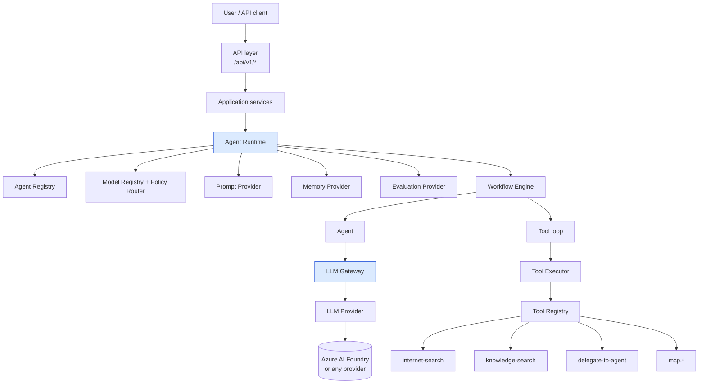
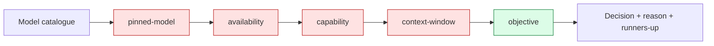
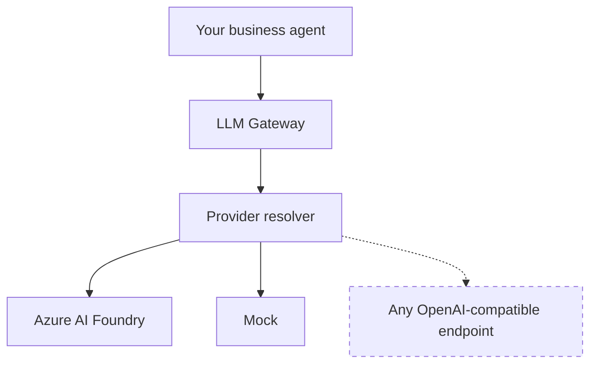
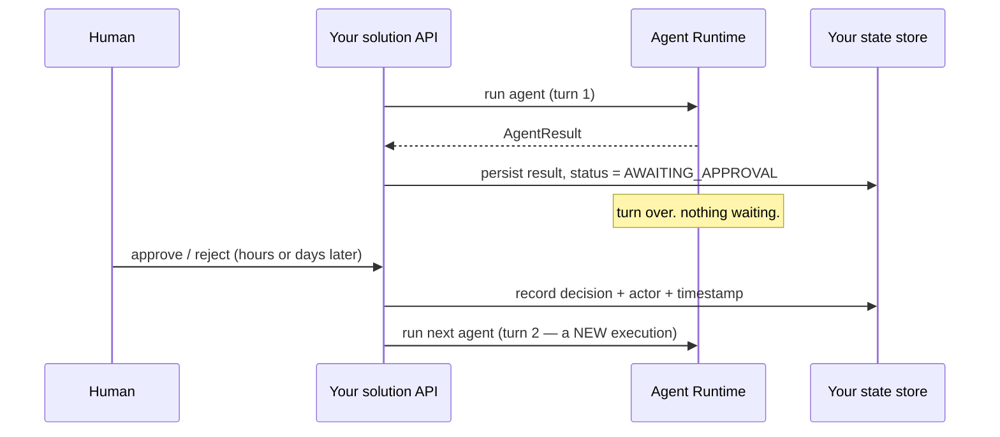
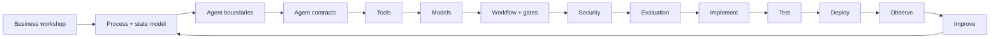

# Developer & Solution Designer Guide

**How to turn a business process into an agentic solution on this platform.**

Two questions this document exists to answer:

> *A solution architect:* "I have a business problem. How should I design this as
> an agentic solution using our platform?"
>
> *A developer:* "Exactly how do I implement it using the platform's existing
> architecture, contracts, agents, tools, models, memory, workflows, evaluation
> and observability?"

The running example throughout is **Internal Fitments** — see
[the reference solution](./internal-fitments-reference.md) for the business
process in full. The example is here to teach the method, not to document
staffing.

Every path, contract and configuration name below was read out of this
repository. Anything the platform does not do yet is labelled; see
[the labels](./README.md#the-labels-and-what-they-mean).

---

## Contents

1. [What the platform gives you](#1-what-the-platform-gives-you)
2. [The 20-step method](#2-the-20-step-method)
3. [Agent boundaries](#3-agent-boundaries-when-to-create-one)
4. [Model selection per agent](#4-model-selection-per-agent)
5. [Provider neutrality and OpenAI-compatible endpoints](#5-provider-neutrality-and-openai-compatible-endpoints)
6. [Tools and side effects](#6-tools-and-side-effects)
7. [State, memory and knowledge](#7-state-memory-and-knowledge)
8. [Human-in-the-loop](#8-human-in-the-loop)
9. [Observability](#9-observability)
10. [Cost management](#10-cost-management)
11. [Security and governance](#11-security-and-governance)
12. [Testing](#12-testing)
13. [Developer workflow](#13-developer-workflow)
14. [Platform team versus solution team](#14-platform-team-versus-solution-team)
15. [Troubleshooting](#15-troubleshooting)
16. [FAQ](#16-faq)

---

## 1. What the platform gives you



**Everything in that diagram exists.** What you write as a solution team sits at
the edges: prompt assets, agent descriptors (as configuration), tools, and the
business state store the platform does not have.

### The contracts you build against

All in [`src/sdk/agent_platform_sdk/interfaces/`](../../src/sdk/agent_platform_sdk/interfaces/).
Every one is a `typing.Protocol` — you satisfy it structurally, with no base
class to inherit ([ADR-0004](../adr/0004-provider-abstraction-via-protocols.md)).

| Contract | You implement it when |
| --- | --- |
| `ToolProvider` | Giving an agent a new capability — **the common case** |
| `Agent` | Almost never. `ChatAgent` is generic; a new agent is configuration plus a prompt |
| `LLMProvider` | Adding a model vendor |
| `MemoryProvider` | Adding a conversation store |
| `SearchProvider` | Adding a web-search backend |
| `EmbeddingProvider` / `VectorStoreProvider` | Adding a retrieval backend |
| `EvaluationProvider` | Adding a metrics or cost sink |
| `WorkflowEngine` | Changing how a turn is orchestrated |
| `PromptProvider` | Storing prompts somewhere other than files |
| `EventPublisher` | Publishing lifecycle events somewhere real |

### The API surface

| Method | Path | Purpose |
| --- | --- | --- |
| `POST` | `/api/v1/chat/messages` | One turn, complete answer |
| `POST` | `/api/v1/chat/messages/stream` | One turn, server-sent events |
| `POST` | `/api/v1/chat/conversations/{id}/regenerate` | Re-answer the last message |
| `GET` | `/api/v1/chat/conversations/{id}` | Read a conversation |
| `DELETE` | `/api/v1/chat/conversations/{id}` | Clear it (204) |
| `GET` | `/api/v1/chat/conversations` | Recent conversations |
| `GET` | `/api/v1/agents` | Registered agents — **the agent cards** |
| `GET` | `/api/v1/tools` | Registered tools and their JSON Schemas |
| `GET` | `/api/v1/models` | The model catalogue |
| `GET` | `/api/v1/analytics/costs` | Spend by model, provider and agent |
| `GET` | `/api/v1/info` | Build identity and effective feature flags |
| `GET` | `/health` `/live` `/ready` | Health probes |

> **The chat API serves exactly one agent, and this is the single biggest thing
> you will have to build.** `ChatMessageRequest` carries `message`,
> `conversation_id`, `model_id`, `temperature` and `max_output_tokens` — **there
> is no `agent_id`** ([`chat.py:62-116`](../../src/backend/agent_platform/api/v1/chat.py#L62-L116)),
> and `ChatService` is constructed with one agent id that it passes to every
> turn ([`chat_service.py:83`](../../src/backend/agent_platform/application/chat_service.py#L83)).
> `GET /api/v1/agents` will happily list six agents of which the HTTP API can
> invoke one; the rest are reachable only as delegation targets.
>
> Addressing an agent by id over HTTP means writing your own router and service
> against `AgentRuntime` in-process. Every "your API calls the runtime" arrow in
> this guide is that piece of work.

Base path is `PLATFORM_SERVER__API_PREFIX`, default `/api`.

OpenAPI is generated automatically, but `/docs`, `/redoc` and `/openapi.json` are
**served only when `PLATFORM_APP__DEBUG` is true**. In a production-like
environment they describe the attack surface, so they are withdrawn along with
debug mode — do not point an integration at `/openapi.json` in production.

---

## 2. The 20-step method

Work in this order. Steps 1–7 are design and produce no code; skipping them is
the single most reliable way to end up with agents whose boundaries you have to
renegotiate later.

For each step: **the questions to ask**, **the platform capability**, **the
Internal Fitments example**, and **the mistake people make**.

### Step 1 — Understand the business process

**Ask:** Who does what, in what order? Where does work wait? What does someone
have to *remember* to do? Which steps are judgement and which are legwork?

**Platform:** None. This is a whiteboard.

**Internal Fitments:** A Staff Request moves from JD upload → evaluation →
shortlist approval → scheduling → interview → feedback → fitment decision. The
briefing's framing is precise: the agents replace the *coordination labor*, not
the judgement calls.

**Mistake:** Starting from "which agents shall we have". Agents fall out of the
process; a process does not fall out of agents.

### Step 2 — Identify business states

**Ask:** What are the distinct statuses a record can hold? What causes each
transition? Which are terminal?

**Platform:** Nothing stores this — see step 7.

**Internal Fitments:** the briefing names two terminal states — **Internal Fit**
and **Internal Fit Rejected** — and describes the rest in prose. Written out as a
status vocabulary it becomes roughly `DRAFT → EVALUATING → AWAITING_APPROVAL →
SCHEDULING → INTERVIEW_BOOKED → AWAITING_FEEDBACK → AWAITING_FITMENT →
INTERNAL_FIT | INTERNAL_FIT_REJECTED`. **The intermediate names are a
reconstruction, not a quotation** — the shape is the reference, not the spelling.

**Mistake:** Modelling conversation as state. A chat thread is not a business
record; it has no status and cannot be queried by anyone else.

### Step 3 — Identify decisions

**Ask:** At each transition, who or what decides? What information does the
decision need? What is the cost of getting it wrong?

**Internal Fitments:** Two decisions carry real consequence — who moves to
interview, and whether a candidate is presentable to a client.

**Mistake:** Treating "the model produces a recommendation" as "the decision is
automated". It is not, until nobody reviews it.

### Step 4 — Separate human decisions from automatable work

**Ask:** If this were wrong, who is accountable? Is it reversible? Would a person
want to have been asked?

**Platform:** **Not implemented — platform gap.** There is no approval
mechanism. §8 gives the design that works today.

**Internal Fitments:** The briefing's automated-vs-human table is
[reproduced in full](./internal-fitments-reference.md#5-what-is-automated-versus-what-needs-a-person),
and includes a third category worth copying: **"manual, by design"** — work the
tool deliberately does not touch.

**Mistake:** Automating a decision because it was technically possible, and
discovering the accountability question only after it is wrong once.

### Step 5 — Identify agent boundaries

See [§3](#3-agent-boundaries-when-to-create-one) and the
[agent design guide](./agent-design-guide.md).

### Step 6 — Define agent contracts

**Ask:** What does this agent accept, return, and guarantee? When is it done?
What are its failure states?

**Platform:** [`AgentDescriptor`](../../src/sdk/agent_platform_sdk/dto/agent.py),
published at `GET /api/v1/agents`. **Partially implemented** against the
briefing's "agent card": it carries identity, model, prompt, `tool_ids` and
policies, but **no declared input/output schema**. The schemas live on the
agent's *tools*.

**Mistake:** Writing the contract in a wiki. It belongs in the descriptor and the
tools' JSON Schemas, where the model and the runtime both read it.

### Step 7 — Define shared state

**Ask:** What is the system of record? Who writes each field? How is a decision
audited?

**Platform:** **Not implemented — you build it.**
[`src/backend/agent_platform/storage/`](../../src/backend/agent_platform/storage/)
is an empty package. `MemoryProvider` stores *conversation messages*, not
business records — do not press it into service as a database.

Build it as its own module, expose it to agents as tools, and keep the platform
between the two. That way the state store is testable on its own and no agent
holds a database handle.

**Mistake:** Letting each agent keep its own copy of status. Two sources of truth
is zero sources of truth — and it is the exact failure the briefing's
[§9](./internal-fitments-reference.md#9-the-point-is-knowing-not-reporting)
describes.

### Step 8 — Define tools

See [§6](#6-tools-and-side-effects) and the
[tool development guide](./tool-development-guide.md).

### Step 9 — Define permissions

**Ask:** Which agent may do which side-effecting thing? Who may ask which
question?

**Platform:** **Partially implemented.** `ToolDescriptor.required_permissions`
exists and **nothing reads it** — a grep across `src/backend/` returns zero
enforcement sites. What *is* enforced: an agent can only call tools it declared
in `tool_ids`, checked in
[`tool_executor.py`](../../src/backend/agent_platform/tools/tool_executor.py)
against `permitted_tool_ids`. And `delegate-to-agent` refuses any agent not in
its configured `delegatable_agent_ids`.

So permissions today are **structural**: they are decided by which agents declare
which tools, not by a permission string. That is enough to keep the Notification
Agent the only sender, and not enough for per-user authorisation.

**Mistake:** Assuming `required_permissions` does something. It documents intent.

### Step 10 — Select models

See [§4](#4-model-selection-per-agent).

### Step 11 — Define memory

**Ask:** Does this agent need to remember the conversation? Across restarts?
Across replicas?

**Platform:** **Implemented.** `PLATFORM_MEMORY__PROVIDER` selects `in-memory`
(default) or `redis` ([ADR-0012](../adr/0012-durable-conversation-memory.md)).
In-memory does not survive a restart and is not shared between replicas.

**Whether an agent has memory is the *caller's* choice, not the agent's.** There
is no "memory: on/off" on `AgentDescriptor` — `memory_provider_id` selects
*which* provider. History loads whenever the turn carries a `conversation_id`
and not otherwise
([`agent_runtime.py:504-519`](../../src/backend/agent_platform/runtime/agent_runtime.py#L504-L519)).

**Internal Fitments:** The Orchestrator's chat wants conversation memory. The
Evaluation Agent does not — and you achieve that by invoking it **without a
`conversation_id`**, which is exactly what delegation does. Configuring the
agent is not the lever; how you call it is.

### Step 12 — Define workflow

**Ask:** Is this one turn, or several? Does anything wait?

**Platform:** **Implemented** for a single turn with a tool loop —
[`workflow/tool_loop.py`](../../src/backend/agent_platform/workflow/tool_loop.py),
shared by both engines. Multi-step business workflows across days are **your
orchestration**, driven from state (§8).

`PLATFORM_WORKFLOW__ENGINE` selects `langgraph` (default) or `direct`. Both
satisfy the same contract and share the same tool loop, which makes `direct` a
**diagnostic lever**: if behaviour differs between the two, the graph library is
implicated and you have halved the search space. That is the reason a
twenty-line second engine exists at all.

### Step 13 — Define guardrails

**Ask:** What must this agent never do? What input must never reach the model?

**Platform:** `AgentDescriptor.guardrails` is declared and marked *Future* —
**not implemented**. Budget, timeout and retry policies **are** enforced.
Prompt-level constraints work and are what the reference prompts use.

### Step 14 — Define observability

See [§9](#9-observability).

### Step 15 — Define evaluation

See the [evaluation guide](./agent-evaluation-guide.md).

### Steps 16–20 — Implement, test, deploy, monitor, improve

See [§13](#13-developer-workflow), the
[checklist](./agent-development-checklist.md), and
[`docs/runbooks/deployment.md`](../runbooks/deployment.md).

---

## 3. Agent boundaries: when to create one

**Create a separate agent when at least two of these are true:**

- Its responsibility is genuinely different
- It needs different tools
- It needs a different model — different capability, cost or latency profile
- Its permissions differ
- Its lifecycle differs (request-driven versus continuous)
- It is evaluated by different criteria
- It could operate independently
- Separating it makes the system easier to maintain

**Do not create one merely because the prompt is different.** A different prompt
for the same tools, model, permissions and evaluation criteria is a *mode* of one
agent, not a second agent.

Internal Fitments passes the test six times. Evaluation needs document reasoning
and a structured output; Scheduling needs tool calling and low latency;
Monitoring runs on a clock; Reporting is read-only; Notification is the single
side-effect gateway; the Orchestrator coordinates. Different tools, different
models, different lifecycles, different failure modes.

### How little a second agent costs here

This is worth internalising, because it changes the calculus. Adding the research
specialist required **no new class**: `ChatAgent` is generic, so an agent is a
descriptor plus a prompt asset.

```python
# src/backend/agent_platform/dependencies/container.py — build_agent_registry
if settings.research_agent.enabled:
    research = settings.research_agent
    research_descriptor = AgentDescriptor(
        agent_id=research.agent_id,
        name="Research Agent",
        description="Searches for current information and answers with cited sources.",
        # Empty inherits the chat agent's, which is the common case. Setting
        # them is how one agent uses a cheaper or stronger model.
        provider_id=research.provider_id or settings.agent.provider_id,
        model_id=research.model_id or settings.agent.model_id,
        prompt_id=research.prompt_id,
        prompt_version=research.prompt_version,
        temperature=research.temperature,
        max_output_tokens=research.max_output_tokens,
        tool_ids=research.tool_ids,
        budget=BudgetPolicy(
            max_tool_invocations=research.max_tool_invocations,
            max_model_calls=research.max_model_calls,
        ),
    )
    registry.register(research_descriptor.agent_id, ChatAgent(research_descriptor, gateway))
```

Note the `if ... enabled:` wrapper — a second agent is off unless configured on,
so a deployment that does not want it pays nothing and lists nothing.

**Known gap.** Agents are registered in Python in `build_agent_registry()`, from
typed settings blocks — not loaded from YAML descriptors. `architecture.md` §17
calls for a descriptor registry, and the code says a YAML registry "replaces it
once there is more than one agent to declare". There are now two. For a six-agent
solution, adding that registry is the first platform change worth making.

---

## 4. Model selection per agent

**Implemented**, and genuinely per agent, per request and per objective.

### How a model is chosen

Every turn runs through a chain of policies in
[`routing/policies.py`](../../src/backend/agent_platform/routing/policies.py):



Red steps are **constraints** — they remove models that *cannot* serve the turn,
and may empty the list, in which case the router names which step did it. The
green step is a **ranking** — it reorders viable models and can never refuse.

That distinction is why asking for the cheapest model can never produce "no model
available". It is also why every decision is explicable: the answer to "why this
model?" is the name of a policy, not a score.

**Choose by capability, not by name.** `Capability` values:
`streaming`, `tool_calling`, `function_calling`, `structured_output`,
`json_mode`, `vision`, `embeddings`, `cost_reporting`. An agent that declares
tools cannot be routed to a model that cannot call them.

### Objectives

`PLATFORM_ROUTING__OBJECTIVE` — one of `balanced` (default), `lowest_cost`,
`largest_context`, `highest_capability`.

`balanced` honours each agent's configured model, and that is the safe default:
an agent's model is an explicit decision by whoever wrote the agent, and
overriding it silently is worse than a marginally higher bill.

### Applied to Internal Fitments

Conceptual, since the models available depend on your deployment:

| Agent | What drives the choice |
| --- | --- |
| Evaluation | Long context (a JD plus many CVs), strong reasoning, `structured_output`. The expensive one — and worth it |
| Scheduling | `tool_calling`, low latency. Reasoning is thin; the tools do the work |
| Monitoring | Cheapest model that can summarise acceptably. It runs constantly |
| Reporting | Fast. Aggregation with a natural-language wrapper |
| Notification | Arguably no model at all — see below |
| Orchestrator | Middle ground: `tool_calling` for delegation, enough reasoning to route |

> **The Notification Agent question.** If its job is "format a message and send
> it", it may not need a model. An agent whose reasoning adds nothing is a cost
> and a latency source. Being able to ask this question — and answer "make it a
> tool, not an agent" — is what a clean tool boundary buys you.

### Switching a model

Configuration only. Nothing in source names a model:

```bash
PLATFORM_AGENT__PROVIDER_ID=azure-foundry
PLATFORM_AGENT__MODEL_ID=fw-kimi-k3
```

This was verified twice across two different models on two subscriptions with no
code change ([`STATUS.md`, Milestone 05](../milestones/STATUS.md)).

---

## 5. Provider neutrality and OpenAI-compatible endpoints



The request and response contracts in
[`dto/completion.py`](../../src/sdk/agent_platform_sdk/dto/completion.py) use
OpenAI-shaped vocabulary — `temperature`, `top_p`, `stop`, `response_format` —
deliberately, so an OpenAI-compatible provider is a translation of nearly
nothing ([ADR-0006](../adr/0006-llm-gateway-and-provider-neutral-contract.md)).

**The rule, from `CLAUDE.md`:** a vendor SDK may be imported **only** inside its
provider package. Today `azure.*` appears in **four modules across three
packages**:

| Module | Inside a provider package? |
| --- | --- |
| `providers/azure_foundry/azure_foundry_provider.py` | Yes |
| `providers/azure_foundry/azure_foundry_embeddings.py` | Yes |
| `security/credentials.py` | No — the one place a credential is built |
| `memory/entra_credentials.py` | **No** |

The last one is the honest exception: Entra ID data-plane auth for Azure Cache
for Redis needs the Azure SDK, and it sits in the memory package rather than a
provider package. It is defensible — it buys durable memory with no stored
password ([ADR-0012](../adr/0012-durable-conversation-memory.md)) — and it is
still a vendor import outside a provider. Know about it before someone else
greps for it.

Your business agents must never import a provider SDK, name a provider in
business logic, or use a provider's request/response types. If you do, changing
model vendor becomes a rewrite instead of an environment variable.

> **This has been tested by reality.** In Milestone 05 an Azure SDK enum leaked
> into an HTTP response body (`"CompletionsFinishReason.STOPPED"`). It passed
> review and 43 tests, because every mock returned plain strings. Only a live
> call found it. Treat the boundary as something to verify, not merely intend.

**Adding a provider** means implementing `LLMProvider` — `generate`, `stream`,
`count_tokens`, `estimate_cost`, `list_models`, plus the `Provider` lifecycle
(`initialize`, `close`, `supports`, `health_check`) — and one branch in the
composition root. No agent, runtime, workflow or gateway change.

---

## 6. Tools and side effects

Full detail in the [tool development guide](./tool-development-guide.md). The
design points that belong in a solution design:

**Agents never call tools.** The runtime does:

```
Agent → Runtime → Tool Registry → Tool → Runtime → Agent
```

That is what makes authorisation, timeout, retry, telemetry and budget
enforcement exist once rather than once per integration.

**The executor never raises.** Every failure — unknown tool, denied tool, bad
arguments, timeout, a tool that threw — becomes a `ToolResult` with
`succeeded=False`. A failing tool is something an agent should reason about, not
something that aborts a user's turn.

**A tool's `description` is prompt material.** It is the entire basis on which a
model decides whether to call it. Vague descriptions produce tools that are never
called, or called for the wrong thing.

### Side effects need more than a tool

For anything that books an interview, sends a message or updates a record:

| Requirement | Platform support |
| --- | --- |
| Explicit authorisation | **Structural only** — via `tool_ids`. No per-user authorisation |
| Idempotency | **Not implemented.** You build it — see below |
| Auditability | Runtime events and structured logs cover the *call*. A business audit record is yours |
| Error handling | **Implemented** — `ToolResult.succeeded=False`, never an exception |
| Retry strategy | **Implemented** — per-tool `RetryPolicy`. Note MCP tools are deliberately *not* retried |
| Human approval | **Not implemented** — §8 |

**Idempotency is yours to build, and it is not optional** for Scheduling and
Notification. The briefing is explicit that every task carries an idempotency
key. Nothing in `ToolInvocation` does. Until the platform grows one, put the key
*inside your tool's arguments schema* and deduplicate in your own store:

```python
"input_schema": {
    "type": "object",
    "properties": {
        "staff_request_id": {"type": "string"},
        "candidate_id": {"type": "string"},
        "idempotency_key": {
            "type": "string",
            "description": (
                "Stable key for this booking. Reuse the same key to retry "
                "safely; a repeat returns the original booking unchanged."
            ),
        },
    },
    "required": ["staff_request_id", "candidate_id", "idempotency_key"],
}
```

Deriving the key from business identity — `f"{staff_request_id}:{candidate_id}:invite"`
— is stronger than letting the model invent one, because a model that retries
will happily invent a second key.

---

## 7. State, memory and knowledge

Three different things, routinely confused:

| | What it holds | Backed by | Status |
| --- | --- | --- | --- |
| **Business state** | Staff Requests, candidates, decisions, audit trail | Your database | **Not implemented — you build it** |
| **Conversation memory** | Messages in a chat thread | `MemoryProvider` — in-memory or Redis | **Implemented** |
| **Knowledge** | Documents to retrieve passages from | Embeddings + vector store, via `knowledge-search` | **Implemented** |

**Business state is the system of record.** Everything else is derived or
transient. If you find yourself reconstructing a candidate's status by reading a
conversation, the design has gone wrong.

**Retrieval is a tool, not a prompt preamble**
([ADR-0015](../adr/0015-retrieval-augmented-generation.md)). The model decides
when documents are needed, so turns that need none spend no context on them, and
the query is visible because the model formulated it.

**How documents get in.** Files under `PLATFORM_KNOWLEDGE__DOCUMENTS_DIRECTORY`
(default `knowledge/`) are chunked and embedded **at startup**, by
`_index_knowledge()` in
[`startup.py`](../../src/backend/agent_platform/dependencies/startup.py) — there
is no ingestion API and no incremental update. Two consequences: the index is
rebuilt on every start and held per replica, and a corpus large enough to matter
turns every restart into an embedding bill. The settings that decide the rest:

| Setting | Note |
| --- | --- |
| `PLATFORM_KNOWLEDGE__ENABLED` | Off by default — the tool is not registered |
| `PLATFORM_KNOWLEDGE__EMBEDDING_PROVIDER` | `local` \| `azure-foundry` \| `hashing` |
| `PLATFORM_KNOWLEDGE__EMBEDDING_DIMENSIONS` | Must match the model — 384 local, 1536 for `text-embedding-3-small` |
| `PLATFORM_KNOWLEDGE__MINIMUM_SCORE` | Defaults to `0.0` — see below |
| `PLATFORM_KNOWLEDGE__MAX_PASSAGES` | Context spend per retrieval |

**Text formats only**: `.md`, `.markdown`, `.txt`, `.rst`
([`document_loader.py:35`](../../src/backend/agent_platform/knowledge/document_loader.py#L35)).
A PDF dropped in that directory is skipped silently.

One measured finding worth carrying into any RAG design: the **score threshold**
is what lets retrieval say *"the corpus has nothing on this"*, and whether it can
depends entirely on the embedder. Measured over the same corpus, the lexical
embedder scored an unanswerable question **higher** than two genuine hits; only a
real embedding model left a usable gap. `minimum_score` defaults to `0` rather
than a number that would look authoritative — tune it against your embedder or
leave it off.

**For Internal Fitments:** JDs and CVs are *per-Staff-Request inputs*, not a
corpus. Give the Evaluation Agent a document-retrieval tool scoped to one Staff
Request rather than indexing every CV the company has ever seen into a shared
vector store, where one candidate's CV can surface in another's evaluation.
(Note also: the loader handles **text formats only** — no PDF or DOCX parser
exists yet.)

---

## 8. Human-in-the-loop

**Not implemented — platform gap.** The runtime executes a turn to completion. It
cannot suspend one and resume it two days later, and holding an HTTP request open
is not an implementation — it fails at the first container restart, which in
development is every scale-to-zero.

**The design that works today: a gate is a terminal state plus a new trigger.**



Three properties follow, and each is why to do it this way:

- The gate **survives a restart**, because the waiting is in a database.
- The decision is an **auditable record** — actor, timestamp, outcome — which is
  exactly what a Service Line Leader override needs.
- Each turn is **independently observable and costed**, with its own correlation
  id and evaluation record.

Use the same shape for scheduled work. There is **no scheduler** in the platform;
an external trigger (Container Apps job, Logic App, cron) calls your API, which
queries state and runs the agent once per item. The agent stays request-shaped —
the only shape the runtime has.

---

## 9. Observability

**Implemented.** Every request carries a correlation id through API → runtime →
agent → tool → provider, in logs and in spans
([ADR-0005](../adr/0005-opentelemetry-first-observability.md)).

**Runtime events** ([`events/runtime_events.py`](../../src/sdk/agent_platform_sdk/events/runtime_events.py)):
`request.received`, `workflow.started|completed|failed`,
`agent.started|completed|failed`, `model.invoked|completed`,
`tool.started|completed`, `memory.loaded|updated`, `policy.violated`.

> Only `LoggingEventPublisher` exists. These events are observability, **not** a
> message bus — nothing subscribes.

**Every turn emits an `EvaluationRecord`**
([`dto/evaluation.py`](../../src/sdk/agent_platform_sdk/dto/evaluation.py)):
correlation and request ids, conversation, session, agent, provider, model,
deployment, prompt version, `occurred_at`, `latency_ms`,
`time_to_first_token_ms`, token usage, `estimated_cost`, `succeeded`,
`streaming`, `retry_count`, `tool_invocations`, `error_category`.

**Failed and abandoned turns are recorded too** — deliberately. Counting only
successes flatters the platform exactly when it is misbehaving: an incident where
half of requests fail would show unchanged cost and *improving* latency.

**Never logged:** secrets, and user content. Records carry counts, identifiers
and money.

### Feature flags are reported, not enforced

`GET /api/v1/info` publishes five flags — `streaming`, `memory`, `search`,
`evaluation`, `cost_tracking` — all defaulting to `false`
([`settings.py:1102-1106`](../../src/backend/agent_platform/configuration/settings.py#L1102-L1106)).

**Exactly one of them is read anywhere in the backend:** `features.search`, which
decides whether the internet-search tool is registered
([`container.py:284`](../../src/backend/agent_platform/dependencies/container.py#L284)).
Memory, evaluation, cost analytics and streaming are wired unconditionally.

So a default deployment reports `cost_tracking: false, evaluation: false,
memory: false` while all three subsystems are running and billing. Treat `/info`
as *what was configured*, never as *what is switched on* — and if you are using
it to diagnose a capability, check the behaviour instead.

If you want a flag to mean something for your own capability, **you implement the
gate**, in `build_*_registry()` or the composition root, the way `features.search`
does. Declaring one buys nothing.

### What to add for your solution

Business-level observability the platform cannot infer: state transitions with
actor and timestamp, gate decisions and time-to-decision, SLA breaches, duplicate
side-effect attempts, and the **human override rate** — the single most
informative number about whether an agent is actually trusted.

---

## 10. Cost management

**Implemented:** `GET /api/v1/analytics/costs`, grouped by model, provider and
agent, fed by cost analytics as an evaluation sink
([ADR-0016](../adr/0016-evaluation-records-and-cost-analytics.md)).

Two caveats that matter before anyone believes a number:

- **Cost is an estimate from configured rates, never an invoice.** An unpriced
  provider contributes zero and therefore reads as free.
- **Rates are per *provider*, not per model.** They live on
  `AzureFoundrySettings` and are stamped onto every model that provider lists
  ([`azure_foundry_provider.py:461`](../../src/backend/agent_platform/providers/azure_foundry/azure_foundry_provider.py#L461)).
  Two differently-priced models behind one provider **cannot be expressed
  today** — you would need a second provider instance, or per-model pricing in
  the registry, which does not exist.
- **The variable names differ by layer, and getting this wrong is silent.**

| Where | Names |
| --- | --- |
| `.env`, Compose, any runtime environment | `PLATFORM_AZURE_FOUNDRY__INPUT_COST_PER_MILLION_TOKENS`, `..._OUTPUT_COST_PER_MILLION_TOKENS`, `PLATFORM_AZURE_FOUNDRY__PRICING_CURRENCY` |
| `azd env set` (infrastructure) | `INPUT_COST_PER_MILLION_TOKENS`, `OUTPUT_COST_PER_MILLION_TOKENS`, `PRICING_CURRENCY` |

  The short names are **azd parameters only**. `main.parameters.json` binds them
  to Bicep, which sets the long `PLATFORM_*` names on the container. Put a short
  name in `.env` and the dotenv source filters it out for lacking the
  `PLATFORM_` prefix — no error, no warning, and cost still reads zero.
- **Totals are per-process and reset on restart.** The endpoint reports this in a
  `scope` field. The durable ledger is the `evaluation.recorded` log stream.

### Designing for cost

| Lever | Applied to Internal Fitments |
| --- | --- |
| Right-size the model per agent | Monitoring runs constantly — do not give it the evaluation model |
| Cap the tool loop | `max_tool_invocations`, `max_model_calls` bound a runaway turn |
| Do not re-do work | Re-running evaluation on an unchanged JD/CV set **reuses** the prior result |
| Do not poll with a model | An SLA check is a database query. Only invoke a model when there is something to say |
| Retrieve, don't stuff | Passing 40 CVs in every prompt costs 40 CVs every turn |
| Bound delegation | Depth 2 by default; raising it multiplies worst-case cost per request |

Budgets are enforced by the runtime, per agent:
`max_total_tokens`, `max_cost`, `max_tool_invocations`, `max_model_calls`. The
last two are checked *between* loop iterations, where stopping still saves the
next call.

---

## 11. Security and governance

### Implemented

- **No API keys for Azure AI Foundry.** `DefaultAzureCredential` — `az login`
  locally, Managed Identity in Azure. Keys are disabled at the resource
  (`disableLocalAuth: true`), so one cannot be used even deliberately.
- **Secrets via Key Vault**, resolved by managed identity at revision start —
  absent from the container's environment definition.
- **Third-party keys** (e.g. Tavily) are `SecretStr`, sent in headers, excluded
  from error messages and logs, with tests asserting they do not leak.
- **No stack traces in API responses.** Full diagnostics stay internal.
- **`gitleaks` in pre-commit**, Trivy and CodeQL in CI.

### Not implemented

- **Authentication and authorisation.** `CLAUDE.md` defers this deliberately:
  *"Do not implement authorization now. Ensure architecture supports it."*
  `ExecutionContext.user_id` and `tenant_id` exist as *Future* fields that
  nothing populates.
- **`required_permissions` enforcement** — declared, never read.
- **Prompt-injection defences** beyond prompt instructions.
- **Data retention and deletion** beyond `DELETE /conversations/{id}`.

### What this means for a solution handling candidate data

Internal Fitments processes CVs, interview transcripts and staffing decisions —
personal data with a real retention obligation. Concretely:

1. **Authorisation is yours, and it belongs in front of the platform.** Scope
   every query in your solution API before it reaches an agent. Do not rely on
   the prompt to keep a PM out of another project's data — a prompt is not an
   access control.
2. **The cost endpoint is unauthenticated and commercially sensitive.** It is the
   first thing to protect.
3. **Never put candidate PII in a tool description, a prompt asset or a log
   field.** Prompts are versioned assets in git; logs are shipped to Log
   Analytics.
4. **Treat CV text as untrusted input.** It is attacker-controlled in the general
   case, and it goes straight into a model's context.
5. **Retention:** decide, and implement it in your state store. The platform will
   not do it for you.

---

## 12. Testing

Layer it, and know what each layer can and cannot prove.

| Layer | Tests | Where |
| --- | --- | --- |
| Unit | Your pure logic — scoring, SLA arithmetic, state transitions | `tests/unit/` |
| Tool | Each tool: happy path, bad arguments, timeout, upstream failure, **idempotent replay** | `tests/unit/tools/` |
| Agent | Descriptor is valid; prompt renders; tools resolve | `tests/unit/` |
| Workflow | The tool loop, budget enforcement, failure propagation | `tests/unit/workflow/` |
| Integration | API in, answer out, against a stub provider | `tests/integration/` |
| End-to-end | A whole Staff Request through both gates | Yours to write |
| Evaluation | Ranking quality against a golden set — see the [evaluation guide](./agent-evaluation-guide.md) | Yours |
| Failure | Interviewer unavailable, invite declined, SLA breached, transcript missing, duplicate notification, portal update fails | Yours |

### The lesson this repository keeps re-learning

**A test double that is more accommodating than the real thing tests the double.**
Recorded instances, each of which passed a full green suite:

- A fake accepted `max_tokens`; the real service returned HTTP 400.
- A fake defined `close()`; the real SDK defines only `aclose()` — every streamed
  connection leaked.
- A mock search backend returned results for any string, hiding a query-mangling
  bug that made every live search return nothing.
- A mock returned plain strings, hiding an SDK enum leaking into the public API.

So: **shape doubles to the real contract, not to your code**, and make at least
one live call before believing a component works.

For Internal Fitments the highest-value failure test is the duplicate: run
`schedule_interview` twice with the same idempotency key and assert **one**
calendar invite exists. That is the test that catches the bug the briefing
specifically designed against.

---

## 13. Developer workflow



### Local loop

```bash
task bootstrap     # one-time: toolchain, dependencies, hooks
task up            # docker compose: backend + frontend
task dev           # or run both natively with hot reload
task check         # every gate CI runs
```

Without Task: `uv sync --all-packages`, `docker compose up`,
`uv run pytest`, `npm --prefix src/frontend test`.

> **Local development against a real model — two supported paths.**
>
> Compose *defaults* to the mock provider; it does not pin it.
>
> **In the container**, set a service principal in `.env`:
> `LOCAL_AGENT_PROVIDER_ID=azure-foundry`, `LOCAL_AGENT_MODEL_ID=<your model>`,
> plus `AZURE_CLIENT_ID` / `AZURE_TENANT_ID` / `AZURE_CLIENT_SECRET`.
> `EnvironmentCredential` is first in the chain and needs no `az` binary, so it
> works inside the image ([`docker-compose.yml:89-100`](../../docker-compose.yml#L89-L100)).
> This is the one place the platform accepts a secret for Azure, which is why it
> is opt-in rather than the default.
>
> **On the host**, `az login` works — but set `AZURE_TOKEN_CREDENTIALS=dev`.
> Without it `DefaultAzureCredential` probes the Managed Identity endpoint
> (169.254.169.254), which does not fail fast off-Azure. It stalls past the model
> timeout, exhausts retries, opens the circuit breaker, and every later request is
> refused without ever reaching the model. The symptom looks nothing like the
> cause.

### Adding a capability, in order

1. **A tool** — [tool guide](./tool-development-guide.md). Register it in
   `build_tool_registry()`.
2. **An agent** — a settings block, a field for it on `PlatformSettings`, a
   prompt asset under `prompts/agents/<name>/`, an entry in
   `build_agent_registry()`. No new class. The `PlatformSettings` field is not
   optional: the root model is `extra="forbid"`, so a `PLATFORM_MY_AGENT__*`
   variable with no matching field **stops startup** rather than being ignored.
   Good behaviour, confusing first failure.
3. **A way to reach it.** The chat API takes no `agent_id` (§1), so a second
   agent needs your own route and service over `AgentRuntime`. Skipping this
   step is why an agent can be registered, healthy, listed at
   `GET /api/v1/agents` — and uncallable.
4. **A health probe**, if the capability has a dependency that can be down. Add
   it in
   [`build_health_probes()`](../../src/backend/agent_platform/dependencies/container.py);
   `/health` reports only what is registered there.
5. **Configuration** — add to `.env.example` (a test asserts it matches the
   settings model) and to `infra/bicep/main.parameters.json` if it must be
   settable in Azure. A parameter missing from that file **silently takes its
   Bicep default** — this shipped once, and 23 documented settings did nothing.
6. **Tests** — at every layer above.
7. **Docs** — an ADR if the decision is expensive to reverse.

### Deploying

`azd up`, then `azd deploy backend` and `azd deploy frontend` **separately** — a
combined deploy has been killed mid-run by a timeout, leaving the frontend on a
placeholder image. Full procedure and traps in
[`docs/runbooks/deployment.md`](../runbooks/deployment.md).

---

## 14. Platform team versus solution team

| Platform team owns | Solution team owns |
| --- | --- |
| Agent Runtime, workflow engines | Business agents (descriptors + prompts) |
| LLM Gateway, provider abstraction | Business tools |
| Model registry, routing policies | Business state store |
| Tool framework and executor | Business data integration |
| Memory, knowledge, embeddings | Business policies and guardrail prompts |
| Telemetry, evaluation, cost analytics | Evaluation datasets and criteria |
| Security infrastructure, secrets | Authorisation over business data |
| Deployment platform, CI/CD | Solution-specific configuration |
| The frontend shell, chat, catalogue and cost views | **Every business screen** — see below |

**The test:** if you are editing a file under
`src/backend/agent_platform/runtime/`, `gateway/` or `registries/` to build a
business feature, stop. Either you have found a genuine platform gap — in which
case it is a platform change with an ADR — or you are about to couple the runtime
to one solution.

### The frontend

[`src/frontend/`](../../src/frontend/) ships a React application with chat,
catalogue, cost-analytics and platform-status features, organised as
`src/features/<feature>/`. It is a **reference client for the platform's own
API**, not an application framework — it has no concept of a business record, a
role or an approval.

Internal Fitments needs an Approvals page carrying both gates and three
role-scoped views. All of that is solution-team work: a new `src/features/`
directory per business surface, against your own API. The platform team owns the
shell, the theming and the existing feature folders; you own everything that
knows what a Staff Request is.

These guides cover the backend. For frontend conventions — component structure,
the query layer, testing — see
[`docs/engineering-handbook.md`](../engineering-handbook.md).

### The platform changes Internal Fitments would need

Six, each general enough to deserve an ADR and to benefit every future solution:

1. **A YAML agent registry** — six agents in `build_agent_registry()` is six
   Python edits, and `architecture.md` §17 already calls for the registry.
2. **Per-agent delegation configuration.** `delegatable_agent_ids` and
   `max_delegation_depth` are constructor arguments to `DelegateToAgentTool` fed
   today from the *research agent's* settings block. An Orchestrator needs its
   own delegatable set, and there is no settings shape for one.
3. **An HTTP route that can address an agent by id** (§1).
4. **An approval/suspension mechanism** — §8 is the workaround, not the fix.
5. **Scheduled execution**, for the Monitoring Agent's SLA watch.
6. **Idempotency on tool invocations** — nothing stops a retried
   `schedule_interview` double-booking.

---

## 15. Troubleshooting

Symptoms observed in this repository, with their real causes.

| Symptom | Likely cause | Check |
| --- | --- | --- |
| Agent not invoked | Not registered, or `is_enabled=false` | `GET /api/v1/agents` |
| Tool never called by the model | Description too vague, or tool not registered | `GET /api/v1/tools`; look for `tool.not_registered` in logs |
| Tool declared but silently absent | An agent's `tool_ids` names a tool this deployment did not register — skipped with a warning, not fatal | `tool.not_registered` |
| "No model available" | A constraint policy emptied the list | The routing decision names the policy — `capability`, `context-window`, `availability` |
| Wrong model answered | Objective is not `balanced`, or the agent's model is unavailable | `PLATFORM_ROUTING__OBJECTIVE`; the decision's ranked runners-up |
| Answers look like mock responses | Provider fell back to mock, or `DefaultAzureCredential` stalled | `GET /api/v1/info`; set `AZURE_TOKEN_CREDENTIALS=dev` locally |
| "Provider temporarily unavailable after repeated failures" | Circuit breaker open — five counted failures | Fix the underlying provider error; the breaker recovers after 30s |
| Chat works, memory does not persist | In-memory provider plus `--reload`, or multiple replicas | `PLATFORM_MEMORY__PROVIDER=redis` |
| Cost reports zero | Rates not configured, **or set under the azd short names in `.env`** where they are silently filtered out | `PLATFORM_AZURE_FOUNDRY__INPUT_COST_PER_MILLION_TOKENS` etc. in a runtime environment; short names only via `azd env set` — §10 |
| `/info` says a capability is disabled but it demonstrably works | Only `features.search` is enforced; the other four flags are declared, published and never read | §9 — believe the behaviour, not the flag |
| Cost lower than expected after a restart | Totals are per-process | The `scope` field; use the log stream as the ledger |
| Config change had no effect in Azure | The parameter is missing from `main.parameters.json` and took its Bicep default | `tests/unit/infrastructure/test_bicep_parameters.py` |
| New endpoint 404s after a successful deploy | `azd provision` reverted the image to the placeholder; the old revision still serves | `az containerapp revision list` |
| Startup fails: `No prompt registered` | Prompt asset missing from the image | `COPY prompts` in the Dockerfile |
| Startup fails: `No module named 'fastembed'` | `knowledge.embedding_provider=local` without the `knowledge` extra | Set it to `azure-foundry`, or `uv sync --extra knowledge` |
| Turn refused before the model ran | Budget policy | `policy.violated` event |
| Delegation refused | Depth limit, or the agent is not in `delegatable_agent_ids` | `delegation.depth_exceeded` |
| Missing telemetry | No OTLP endpoint configured | `PLATFORM_TELEMETRY__OTLP_ENDPOINT` |
| Odd behaviour you suspect is the graph library | — | Set `PLATFORM_WORKFLOW__ENGINE=direct`; identical behaviour clears LangGraph |
| A tool call aborts the whole turn instead of returning a failure | Your `validate()` raised something outside `PlatformError` | Raise `ValidationError` — [tool guide §1](./tool-development-guide.md#two-guarantees-to-build-against) |
| A new `PLATFORM_MY_THING__*` variable stops startup | No matching field on `PlatformSettings`; the root model is `extra="forbid"` | Add the field beside `research_agent` in `settings.py` |

---

## 16. FAQ

**When should I create a new agent?** When at least two of the criteria in §3
hold. Not for a different prompt alone.

**When should I reuse one?** When the responsibility, tools, model, permissions
and evaluation criteria are the same and only the wording differs.

**How do I decide agent boundaries?** Draw the business process, mark every
decision, mark every side effect, then group work that shares a lifecycle and a
failure domain. The briefing's own justification is the test: *a scheduling bug
can't corrupt an evaluation.*

**When is a workflow better than an agent?** When the sequence is fixed and known
in advance. Deciding *what to do next* is what a model is for; executing a known
sequence is what code is for, and code is cheaper, faster and deterministic.

**How do agents communicate?** Through the runtime, never directly, via the
`delegate-to-agent` tool. Depth-bounded at 2 by default.

**How is business state maintained?** By you. The platform has no state store.

**How do I select a model?** Configure `provider_id`/`model_id` per agent and let
the router apply policy. Choose on capability, context, latency and cost.

**Can different agents use different models?** Yes — set `provider_id` and
`model_id` on each descriptor. Empty inherits the primary agent's.

**How do I add a tool?** Implement `ToolProvider`, register it in
`build_tool_registry()`, add its id to an agent's `tool_ids`. See the
[tool guide](./tool-development-guide.md).

**How do I implement a side-effecting tool?** With an idempotency key in its
argument schema, deduplicated in your own store, plus an audit record. §6.

**How do I add human approval?** Terminal state plus a separate resumption
trigger. §8. Do not hold a turn open.

**How do I add an OpenAI-compatible endpoint?** Implement `LLMProvider` in its
own package under `providers/`, add one branch in the composition root. No agent
or runtime change. §5.

**How do I test an agent?** Descriptor validity and prompt rendering as unit
tests; the tool loop at the workflow layer; the whole path as integration with a
stub provider — then make at least one live call. §12.

**How do I evaluate an agent?** A golden dataset and criteria you define. The
platform records the mechanics — tokens, latency, cost, success — not quality.
See the [evaluation guide](./agent-evaluation-guide.md).

**How do I measure cost?** `GET /api/v1/analytics/costs`, once rates are
configured. §10.

**How do I deploy a business solution?** `azd up`, then deploy each service
separately. [`docs/runbooks/deployment.md`](../runbooks/deployment.md).

---

## Next

- [Agent design guide](./agent-design-guide.md) — contracts, patterns, anti-patterns
- [Tool development guide](./tool-development-guide.md) — building capabilities
- [Evaluation guide](./agent-evaluation-guide.md) — proving it works
- [Checklist](./agent-development-checklist.md) — before you ship
