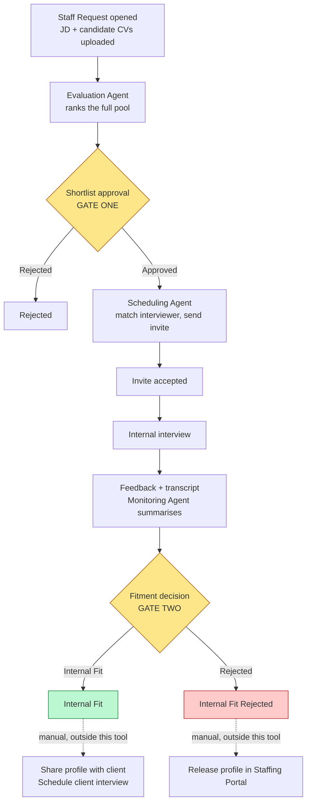
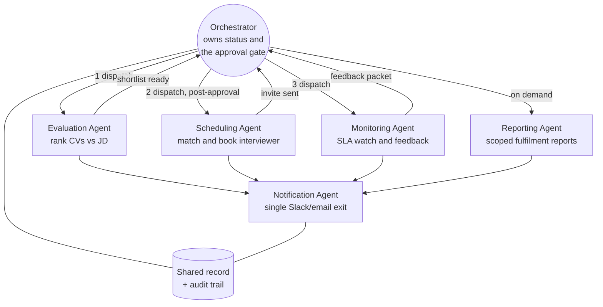
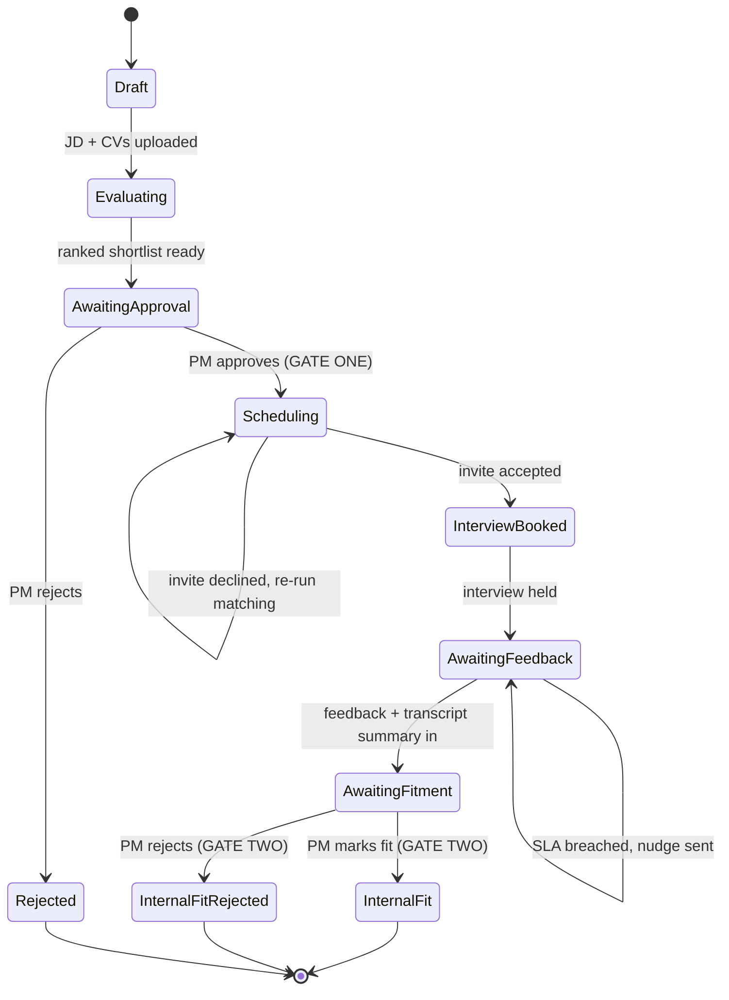
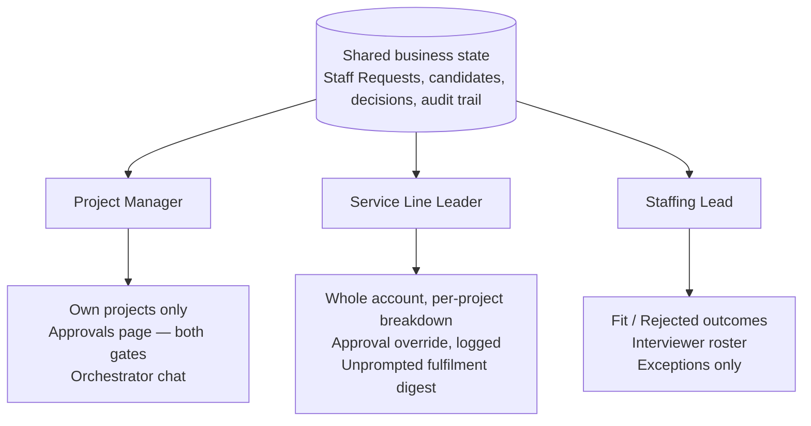
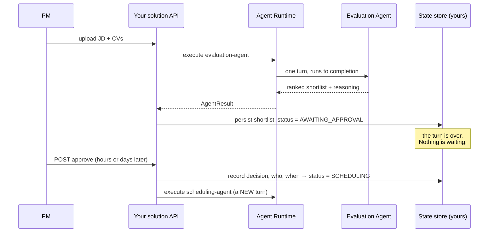

# Internal Fitments — the reference solution

**Source:** *Internal Fitments — Agentic Way*, Account Staffing briefing
(Globant). Working prototype, live demo ready, mock data only.

This document describes the business process and the six-agent design faithfully
to that briefing, then maps every concept onto this platform's actual
implementation. It is the worked example the rest of the guide refers back to.

> **Scope, as the briefing states it.** This covers the **internal fitment**
> process — our own panel vetting a candidate before their profile ever reaches
> the client. It stops at the moment we decide a candidate is presentable.
> **Sharing the profile with the client and scheduling the client-side interview
> are deliberately manual**, outside the tool. That relationship stays with the
> account team.

The briefing's four headline numbers, because each one is a design constraint
rather than a boast:

| | |
| --- | --- |
| **6** | specialist agents |
| **2** | human decision gates per candidate |
| **0** | manual status-chasing needed |
| **100%** | of side-effects logged and auditable |

---

## 1. The business process

Every open position is tracked as a **Staff Request**, ticket prefix `SR-`
(e.g. `SR-102`). One record moves through a fixed set of stages. Each arrow used
to require someone to notice, remember, and tell the next person; each now fires
when the previous step finishes.



**Amber = a human decision gate. Green = Internal Fit. Red = Rejected. Dashed =
manual, outside this app.**

### The two places a human is required to act

**Gate one — shortlist approval.** The project's PM (or the Service Line Leader,
as an override) reviews the AI's ranked shortlist and its reasoning before anyone
is invited to interview.

**Gate two — fitment decision.** After the internal interview and its transcript
summary come back, that same PM decides whether the candidate is **Internal Fit**
— ready for the client — or not.

Every other arrow fires on its own. Both gates surface together on one
**Approvals** page scoped to the PM's own projects: one place to check, not two.

---

## 2. The six agents

Each agent owns one narrow job end to end and nothing else. The briefing is
explicit that this is deliberate, not incidental: *a scheduling bug can't corrupt
an evaluation, and a Slack outage can't block an interview from being booked.*



**Numbered arrows are the default sequence for one position. The Notification
Agent is the only path to Slack or email, so nothing gets announced twice.**

| # | Agent | Trigger | Skills it publishes | What it removes |
| --- | --- | --- | --- | --- |
| 01 | **Orchestrator** | Always on | `pipeline_status`, `approve_shortlist`, `answer_scoped_queries` | Asking around / checking three sheets to find where a role stands |
| 02 | **Evaluation** | On upload | `evaluate_candidates`, `explain_ranking` | Manually reading every CV for a first-pass shortlist |
| 03 | **Scheduling** | On approval | `match_interviewer`, `schedule_interview` | Manually cross-checking interviewer skills and availability |
| 04 | **Monitoring** | Continuous | `track_invite_sla`, `collect_feedback`, `summarize_transcript` | Manually tracking who hasn't responded and chasing them |
| 05 | **Reporting** | On demand | `fulfillment_report`, `role_scoped_summary` | Manually compiling a status deck before a review |
| 06 | **Notification** | Every side-effect | `send_notification`, `notification_log` | "Wait, did I already tell the candidate/interviewer that?" |

### 2.1 Orchestrator — coordination, not execution

The conductor. Owns every position's current status and the PM-approval gate, and
is the one you talk to directly: *"what's the status of a ticket"*, *"how many
open roles do we have"* — answered from live data, scoped to what you are allowed
to see.

**Why it must not do the specialists' work.** The moment the Orchestrator ranks a
CV itself, four things follow: it needs the document-reasoning model even when it
is only answering a status question; its prompt grows to cover evaluation, and
degrades at coordination; an evaluation bug now takes down status queries; and
you can no longer scale, price or evaluate the two jobs separately. This is the
"God Agent" `CLAUDE.md` forbids, and it always arrives one convenience at a time.

### 2.2 Evaluation — structured output and explainability

Reads the JD and every candidate CV, ranks the full pool, and writes out its
reasoning per candidate — strengths, gaps, why it ranked them where it did. Not
just a number.

Two properties worth naming:

- **Explainability is the deliverable, not a bonus.** Gate one is a human reading
  the reasoning. A ranking without a rationale gives the PM nothing to approve
  and pushes them back to reading CVs.
- **Idempotency.** Re-running on an unchanged JD/CV set reuses the prior result
  instead of re-spending the work. Evaluation is the most expensive agent in the
  system; a duplicate click must not cost twice.

### 2.3 Scheduling — tools, constraints and side effects

Matches each approved candidate to the best-available interviewer by skill
overlap **and current interview load** — not just "who's free" but "who's the
right fit and isn't already overloaded" — and sends the invite.

Sending an invite is a **side effect on a real person's calendar**. It is the
first place in the process where a retry can do visible damage.

### 2.4 Monitoring — continuous, SLA-driven, event-shaped

Watches every open invite against its SLA and nudges the interviewer
automatically if it's breached — nobody has to remember to chase. Once feedback
lands it summarises the interview transcript and routes it straight to the
interviewer and the project's PM: the exact input the PM needs to decide Internal
Fit or not.

This is the only agent that is not request-shaped. It runs on a clock, not on a
user's message.

### 2.5 Reporting — read-only, scoped, aggregating

Compiles a fulfilment summary scoped to whoever's asking: a PM gets their
project, a Service Line Leader gets the whole account with a per-project
breakdown. The Staffing lead uses its chat directly to ask which candidates just
came out Internal Fit or Rejected, rather than waiting on a PM to say so.

A byproduct of the live status data, not the main event — see §6.

### 2.6 Notification — one door out

The single door out to Slack and email. Every other agent routes its
notifications through here, which is what guarantees nobody gets pinged twice for
the same event, and gives one place to see everything that has gone out.

> **The transferable principle:** centralise a cross-cutting side effect when
> several agents need it. Four agents each sending their own Slack message is
> four rate limiters, four retry policies, four audit trails and no way to
> answer "did we already tell them?".

---

## 3. Agent-to-agent communication (A2A)

The briefing describes three mechanisms. All three are worth stealing; only some
have a counterpart in this platform today.

**Agent card.** Each agent publishes a machine-readable description — its name,
its exact skills, and the shape of the task it accepts — *the same way a job
description tells a new hire what they're responsible for*.

**Task envelope.** When one agent finishes, it does not ping a person to start
the next step: it writes a task envelope the next agent picks up automatically.

**Idempotency key.** Every task carries one, so if anything retries — a flaky
network, a duplicate click — the system recognises *"I already did this"* instead
of double-booking an interview or double-sending a notification.

### How each maps onto this platform

| Briefing concept | This platform | Status |
| --- | --- | --- |
| Agent card | [`AgentDescriptor`](../../src/sdk/agent_platform_sdk/dto/agent.py) — identity, model, prompt, `tool_ids`, budget/timeout/retry policies; published at `GET /api/v1/agents` | **Implemented**, with a narrower field set — see below |
| Skills a card advertises | [`ToolDescriptor`](../../src/sdk/agent_platform_sdk/dto/tool.py) — `tool_id`, `description`, `input_schema`, `output_schema`; published at `GET /api/v1/tools` | **Implemented** |
| Agent hands work to agent | [`delegate-to-agent`](../../src/backend/agent_platform/tools/delegate_tool.py) — a tool, so the runtime mediates | **Implemented** |
| Task envelope picked up automatically | No queue and no event bus. Delegation is synchronous and caller-driven; the only `EventPublisher` implementation logs. | **Not implemented — platform gap** |
| Idempotency key | Nothing in `ToolInvocation` or the runtime carries one | **Not implemented — platform gap** |
| Machine-readable inputs/outputs on the *agent* | The descriptor has no input/output schema — only its tools do | **Not implemented — platform gap** |

Two of those gaps matter enough to design around, and §7 says how.

### One service now, six services later

The briefing is careful about its own deployment topology, and the reasoning
transfers directly:

> In this prototype all six run as one coordinated service sharing one datastore
> — that's a deliberate build choice for a fast, demoable prototype, not a
> limitation of the design. Because every agent already speaks the A2A contract,
> any of them can be pulled out into its own independently-scaled service later
> — e.g. if evaluation volume grows — without changing how the others talk to it.

**This platform is built the same way, for the same reason.** All agents live in
one process's [`AgentRegistry`](../../src/backend/agent_platform/registries/),
and `delegate-to-agent` resolves the specialist in-process. But no agent holds a
reference to another — every hop goes
`Agent → Runtime → Agent`, which is exactly what `CLAUDE.md` requires. Splitting
the Evaluation Agent into its own service would therefore be a change to how the
delegation tool *resolves* an agent, not a change to any agent.

The transferable rule: **decide the boundary in the contract, and the topology
stays a deployment decision.** Get that backwards — let one agent call another
directly because they happen to share a process — and the topology is frozen the
day you write it.

---

## 4. State-driven design

A position is a record with a status, and each agent acts according to that
status. This is the difference between an agentic *system* and a chatbot that
happens to call functions.

> **The status names below are a reconstruction, not a quotation.** The briefing
> names the two terminal states — **Internal Fit** and **Internal Fit Rejected** —
> and describes the stages in prose; it does not publish a status vocabulary. The
> intermediate names here are illustrative. Treat the *shape* as the reference
> and pick your own names.



The loop of the whole design is:

```
Business state → determine required action → select agent → execute
     ↑                                                          ↓
     └────────────── update state ← record the outcome ─────────┘
```

**Where the state lives is your decision, and the platform does not make it for
you.** [`src/backend/agent_platform/storage/`](../../src/backend/agent_platform/storage/)
is an empty package, and the memory providers store *conversation messages*, not
business records. See §7.

---

## 5. What is automated versus what needs a person

The briefing calls this *"the list to defend the design against, not a marketing
claim"*. Reproduced exactly.

| Step | Who / what does it | Human involved? |
| --- | --- | --- |
| Screen & rank candidates against the JD | Evaluation Agent | Automated |
| Decide which candidates move forward | Project Manager | **Required decision** |
| Match candidate to the right interviewer | Scheduling Agent | Automated |
| Accept / decline the interview invite | Interviewer | **Required decision** |
| Chase an overdue invite response | Monitoring Agent | Automated |
| Judge interview performance | Interviewer | **Required decision** |
| Summarize the transcript & route it to PM + interviewer | Monitoring Agent | Automated |
| Decide Internal Fit or Internal Fit Rejected | Project Manager | **Required decision** |
| Share the profile with the client | Account team | Manual, by design |
| Schedule the client interview | Account team | Manual, by design |
| Answer "which candidates are Internal Fit / Rejected" | Reporting Agent (chat) | Automated |
| Reserve (Internal Fit) or release (Rejected) the profile in the Staffing Portal | Staffing lead | Manual, by design |
| Notify the right people at every status change | Notification Agent | Automated |
| Compile a fulfilment report | Reporting Agent | Automated |
| Answer "what's the status of X" | Orchestrator (chat) | Automated |

Note the third category. **"Manual, by design"** is not the same as "not built
yet" — it is a decision about where the tool's boundary sits, and writing it down
is what stops the boundary drifting later.

> **What this is not.** It doesn't decide who's presentable to the client. A
> person still ranks the final shortlist decision, still runs the actual
> interview, still makes the internal-fit call, still owns the relationship with
> the candidate and the client. The agents remove the busywork *around* those
> decisions — reading every CV cold, tracking who's free, remembering to follow
> up, compiling what was discussed — so the time a PM spends is spent on the
> decision itself, not the legwork to get there.

---

## 6. Role-based experience

The same prototype, seen from three seats. Names match the live demo data.

| Person | Role | Default scope |
| --- | --- | --- |
| **Hitesh** | PM, Project Levvia | Their own project |
| **Suchita** | PM, Project Spotlight | Their own project |
| **Shantanu** | Service Line Leader | Account-wide |
| **Disha** | Staffing | Account-wide |



### Hitesh — Project Manager

1. Uploads the JD and a folder of CVs. No formatting, no template — the
   Evaluation Agent parses PDF, DOCX or plain text and extracts each candidate's
   name and email itself. **(Prototype capability, not a platform one — this
   platform's document loader handles `.md`, `.markdown`, `.txt` and `.rst`
   only; see §7. A PDF is skipped silently.)**
2. **Evaluation Agent** returns a ranked shortlist with reasoning.
3. Approves or rejects the shortlist — **gate one**.
4. **Scheduling + Monitoring Agents** book, track and chase interviews. Hitesh
   isn't in this loop at all unless something needs escalating.
5. Marks Internal Fit or rejects — **gate two**. From here, sharing the profile
   and scheduling the client interview is his call to make manually.
6. Checks status by asking, not searching: *"What's the status of my open Levvia
   positions?"* in the Orchestrator chat — never a spreadsheet.

| Before | Now |
| --- | --- |
| Manually screens every CV before shortlisting | Reviews an AI-ranked shortlist with reasoning |
| Emails/Slacks the panel to find an available interviewer | Interviewer is matched and invited automatically |
| Checks in on interviewers who haven't responded | SLA reminders fire on their own |
| Chases the interviewer for their notes, then writes up a summary by hand | Transcript summary lands in his inbox unprompted — he just decides fit or not |
| Updates a tracker sheet after every status change | Status is always current — nothing to update by hand |

### Shantanu — Service Line Leader

Sees every project's board in one place, account-wide by default. Steps in only
as an approval fallback — and **every approval decision is logged with who acted
and when, including any Service Line Leader override**, so escalations stay
auditable. The Reporting Agent sends a fulfilment digest without being asked.

| Before | Now |
| --- | --- |
| Pings each PM individually for a status readout | Full account view on demand |
| Manually rolls up multiple sheets into one account view | Fulfilment digest compiles itself |
| No single audit trail for who approved what | Every decision is a timestamped, attributable record |

### Disha — Staffing Lead

Asks the Reporting Agent who just came out Internal Fit or Rejected — her
interest is the outcome, not the interview. Updates Globant's Staffing Portal to
reserve (Internal Fit) or release (Rejected) the profile; that handoff is manual,
outside the app, by the same design as sharing a profile with the client.
Maintains the interviewer roster — skills, seniority and role, *the input the
matching algorithm actually uses*. Sees only the exceptions: a declined invite or
a breached SLA, with one click to re-run scheduling.

---

## 7. Mapping the solution onto this platform

The point of the table: **what you would reuse, what you would build, and where
the platform would have to change.** No path here is invented; each was read out
of the repository.

| Internal Fitments concept | Platform capability | Repository implementation | Status |
| --- | --- | --- | --- |
| Any of the six agents | Agent Runtime + `AgentDescriptor` + a prompt asset | [`runtime/agent_runtime.py`](../../src/backend/agent_platform/runtime/agent_runtime.py), [`dto/agent.py`](../../src/sdk/agent_platform_sdk/dto/agent.py), [`prompts/agents/`](../../prompts/agents/) | **Implemented.** `ChatAgent` is generic; a specialist is configuration plus a prompt, no new class |
| Agent card | `AgentDescriptor`, published at `GET /api/v1/agents` | [`api/v1/catalogue.py`](../../src/backend/agent_platform/api/v1/catalogue.py) | **Partially implemented** — identity, model, tools, policies; no declared input/output schema |
| Skills a card advertises | `ToolDescriptor` with JSON Schema, at `GET /api/v1/tools` | [`dto/tool.py`](../../src/sdk/agent_platform_sdk/dto/tool.py) | **Implemented** |
| Orchestrator dispatching a specialist | `delegate-to-agent` tool; runtime mediates every hop | [`tools/delegate_tool.py`](../../src/backend/agent_platform/tools/delegate_tool.py) | **Implemented**, with a depth guard (`DEFAULT_MAX_DELEGATION_DEPTH = 2`) |
| Task envelope, picked up automatically | — | Only `LoggingEventPublisher` exists in [`events/publisher.py`](../../src/backend/agent_platform/events/publisher.py) | **Not implemented — platform gap.** Delegation is synchronous |
| Idempotency key | — | `ToolInvocation` has `tool_id`, `arguments`, `call_id` only | **Not implemented — platform gap.** Critical for Scheduling and Notification |
| Evaluation Agent's structured ranking | `ResponseFormat` on `CompletionRequest` | [`dto/completion.py:112`](../../src/sdk/agent_platform_sdk/dto/completion.py#L112) | **Partially implemented** — the field is carried; **no provider reads it**. Parse and validate the JSON yourself |
| Reading a JD / CV (PDF, DOCX) | Knowledge document loader | [`knowledge/document_loader.py`](../../src/backend/agent_platform/knowledge/) | **Partially implemented** — text formats only, no PDF or DOCX parser |
| Interviewer roster lookup, Staffing Portal, Slack/email | Tool framework — local, REST, Azure Function or MCP | [`tools/`](../../src/backend/agent_platform/tools/), [`tools/mcp/`](../../src/backend/agent_platform/tools/mcp/) | **Not implemented — you build it.** The seam is [ADR-0010](../adr/0010-tool-framework-and-internet-search.md) / [ADR-0014](../adr/0014-mcp-tools-as-an-adapter.md) |
| Staff Request state, candidate records, audit trail | — | [`storage/`](../../src/backend/agent_platform/storage/) is an empty package; memory providers store conversation messages | **Not implemented — you build it.** The largest single piece of work |
| Both human decision gates | — | Nothing in the runtime can pause and resume a turn | **Not implemented — platform gap.** §8 gives the design that works today |
| Monitoring Agent's continuous SLA watch | — | No scheduler, no background execution | **Not implemented — platform gap.** Drive it externally |
| Notification Agent as the single door | Tool registry + `required_permissions` | `required_permissions` is declared on `ToolDescriptor` and **never read** — grep confirms zero enforcement sites | **Partially implemented.** Enforced by *which agents declare the tool*, not by permissions |
| Different model per agent | Model registry + policy router | [`routing/policies.py`](../../src/backend/agent_platform/routing/policies.py), [`routing/policy_router.py`](../../src/backend/agent_platform/routing/policy_router.py) | **Implemented.** Per agent, per request, by objective |
| Every model call | LLM Gateway over a provider-neutral contract | [`gateway/`](../../src/backend/agent_platform/gateway/), [ADR-0006](../adr/0006-llm-gateway-and-provider-neutral-contract.md) | **Implemented** |
| Conversation memory | `MemoryProvider` — in-memory or Redis | [`memory/`](../../src/backend/agent_platform/memory/), [ADR-0012](../adr/0012-durable-conversation-memory.md) | **Implemented** |
| Role-scoped answers ("scoped to what you're allowed to see") | `ExecutionContext.user_id` / `tenant_id` | Declared as *Future* in [`execution_context.py`](../../src/sdk/agent_platform_sdk/contracts/execution_context.py); nothing populates or enforces them | **Not implemented — platform gap.** `CLAUDE.md` defers authorisation deliberately |
| "100% of side-effects logged & auditable" | Structured logs + runtime events + evaluation records | [`telemetry/`](../../src/backend/agent_platform/telemetry/), [`events/publisher.py`](../../src/backend/agent_platform/events/publisher.py), [`dto/evaluation.py`](../../src/sdk/agent_platform_sdk/dto/evaluation.py) | **Implemented** for platform actions. A *business* audit trail — who approved what — is yours to store |
| Fulfilment reports | — | The Reporting Agent is an agent with query tools over your state store | **Not implemented — you build it** |
| Cost per agent / model / provider | Cost analytics as an evaluation sink | [`evaluation/cost_analytics.py`](../../src/backend/agent_platform/evaluation/cost_analytics.py), `GET /api/v1/analytics/costs` | **Implemented** |

### The honest summary

The platform gives you, today and without modification: the runtime, the agent
and tool contracts, mediated delegation with a cycle guard, per-agent model
routing, the LLM gateway, memory, retrieval, telemetry, cost analytics and the
whole deployment path.

**Six things stand between that and Internal Fitments running on it:**

1. **A business state store.** Staff Requests, candidates, decisions, audit
   trail. Conversation memory is not this.
2. **An HTTP route that can address an agent by id.** `ChatMessageRequest`
   carries no `agent_id` and `ChatService` holds exactly one
   ([`chat_service.py:83`](../../src/backend/agent_platform/application/chat_service.py#L83)),
   so **the shipped API can invoke one of the six.** The others are reachable
   only as delegation targets until you write a router over `AgentRuntime`.
   Every "your API → runtime" arrow in §8 is this.
3. **Human decision gates.** The runtime executes a turn to completion; it cannot
   suspend one for two days waiting on a PM.
4. **Scheduled execution.** The Monitoring Agent's SLA watch has no trigger.
5. **Idempotency.** Nothing stops a retried `schedule_interview` from
   double-booking.
6. **Per-agent delegation configuration.** `delegatable_agent_ids` and
   `max_delegation_depth` come from the *research agent's* settings block today;
   an Orchestrator has nowhere to declare its own delegatable set.

Add to that the **UI**: an Approvals page carrying both gates and three
role-scoped views. [`src/frontend/`](../../src/frontend/) gives you a shell,
theming and a working query layer, and knows nothing about a Staff Request.

None is a flaw in the platform's design — items 3 and 4 are on the roadmap in
`CLAUDE.md`, and item 5 belongs to whoever owns the side-effecting tool. But all
six are real work, and a plan that assumes they are already there will be wrong
by weeks.

---

## 8. Designing the two gates with what exists today

You cannot pause a turn. You can stop needing to.

**Do not** model a gate as one long-running agent execution that waits. There is
no suspend/resume in [`agent_runtime.py`](../../src/backend/agent_platform/runtime/agent_runtime.py),
and holding an HTTP request open for two days fails at the first container
restart — which in development is `minReplicas: 0`, so it fails immediately.

**Do** model a gate as a **terminal state plus a separate resumption trigger**:



Three properties fall out of this, and each is the reason to do it:

- **The gate survives a restart**, because the waiting is in your database rather
  than in a process.
- **The decision is an auditable record** — actor, timestamp, outcome — which is
  exactly what the Service Line Leader override needs.
- **Each turn is independently observable and costed**, because each is a real
  runtime execution with its own correlation id and evaluation record.

Apply the same shape to the Monitoring Agent: an external scheduler (Azure
Container Apps job, Logic App, cron) calls your API on an interval; your code
queries state for breached SLAs and runs the agent once per breach. The agent
stays request-shaped, which is the only shape the runtime has.

---

## 9. The point is knowing, not reporting

The briefing closes on this, and it is the sharpest lesson in the document:

> It's tempting to sell this on the reports it can generate. That undersells it.
> The actual shift is that status stops being something you have to *produce* and
> becomes something that's simply always true and always visible.

| Status today | Status in the prototype |
| --- | --- |
| Lives in whoever last updated the sheet's head | One board, every position, always current |
| Stale the moment something changes in Slack instead | A status badge changes the instant an agent acts — nothing to sync |
| Getting an answer means asking a person and waiting | Getting an answer means typing a question and reading the reply |

For a solution designer, this converts into a concrete test of your design:

> If a status value can be *wrong* — because someone forgot to update it — you
> have built a reporting system. If it can only ever be *behind* — because an
> agent hasn't run yet — you have built a state machine. Only the second one
> stops people asking each other for status.

Design so that every status is derived from agent actions on shared state, never
transcribed by a person into a second place.

---

## 10. Where this stands

**Stays with people, by design.** Sharing the profile with the client, scheduling
the client interview, and updating Globant's Staffing Portal to reserve or
release the candidate.

**Next step.** A working prototype, demoable end to end **on mock data only**.
Further approvals are needed to implement it using Glob.ai.

For how to generalise all of this into a method you can apply to a different
business process, continue to the
[Developer & Solution Guide](./developer-solution-guide.md).
