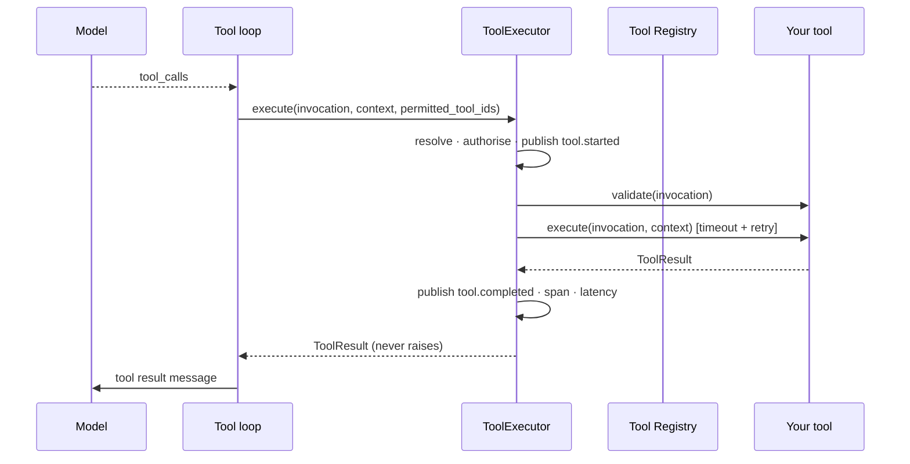

# Tool development guide

Tools are how an agent reaches anything outside its own reasoning. For a business
solution they are **most of the work you will write** — the agents themselves are
configuration.

Running example: **Internal Fitments** ([reference](./internal-fitments-reference.md)).

---

## 1. How tool execution works

Agents never call tools. The runtime does
([`architecture.md` §33](../../.claude/architecture.md)):

```
Agent → Runtime → Tool Registry → Tool → Runtime → Agent
```



Everything in the middle band — resolution, authorisation, validation, timeout,
retry, telemetry, budget — happens once, in
[`tool_executor.py`](../../src/backend/agent_platform/tools/tool_executor.py),
for every tool. Implemented per tool it would be written once per integration,
drift immediately, and the tenth tool would be the one that forgot to log.

### Two guarantees to build against

**The executor never raises — provided your tool raises the right family.**
Unknown tool, denied tool, timeout, a tool that threw inside `execute` — all
become a `ToolResult` with `succeeded=False`. But `validate()` is wrapped in
`except PlatformError` only
([`tool_executor.py:173`](../../src/backend/agent_platform/tools/tool_executor.py#L173)),
so a `ValueError` or `KeyError` out of *your* `validate` propagates and aborts
the turn. Raise `ValidationError`.

> A shipped tool gets this wrong today:
> [`delegate_tool.py:186`](../../src/backend/agent_platform/tools/delegate_tool.py#L186)
> raises a bare `ValueError` when `task` is empty, so a model emitting
> `delegate-to-agent` with no task breaks the turn instead of receiving a
> correctable failure. Worth an issue; do not copy the pattern.

**An agent can only call what it declared — unless the list is empty.** A model
can emit any tool name, including one it inferred from the conversation. The
executor checks the invocation against the agent's `tool_ids`.

The check is `if permitted_tool_ids and invocation.tool_id not in permitted_tool_ids`
([`tool_executor.py:157`](../../src/backend/agent_platform/tools/tool_executor.py#L157))
— **an empty tuple disables authorisation entirely**. That is safe on the shipped
path, because `run_tool_loop` returns early when an agent declares no tools. It
is *not* safe for anything that calls `ToolExecutor` directly: a custom
`WorkflowEngine`, an evaluation harness, a script. Since §14 of the
[solution guide](./developer-solution-guide.md#14-platform-team-versus-solution-team)
says implementing `WorkflowEngine` is legitimate solution work, always pass the
agent's `tool_ids` explicitly and never rely on the default.

---

## 2. The contract

Implement [`ToolProvider`](../../src/sdk/agent_platform_sdk/interfaces/tool_provider.py)
— a `Protocol`, so no base class:

| Member | Purpose |
| --- | --- |
| `provider_id` | Registration id |
| `descriptor` → `ToolDescriptor` | Metadata and JSON Schemas |
| `validate(invocation)` | Cheap pre-check. **Must raise a `PlatformError` subclass** — usually `ValidationError`. The executor catches only those; anything else escapes and aborts the turn |
| `execute(invocation, context)` → `ToolResult` | Do the work |
| `initialize()` / `close()` | Lifecycle — open and release resources |
| `supports(capability)` | Usually `False` — tools are not model capabilities |
| `health_check()` → `ComponentHealth` | Reported at `/health` |

### `ToolDescriptor`

| Field | Notes |
| --- | --- |
| `tool_id` | Stable. Agents name it in `tool_ids` |
| `description` | **This is prompt material** — see §3 |
| `version`, `owner` | Accountability |
| `input_schema` | JSON Schema, sent to the model. **Not enforced by the platform for local tools** — see below |
| `output_schema` | JSON Schema for the success payload |
| `required_permissions` | **Declared, never read.** Zero enforcement sites in `src/backend/` |
| `timeout_seconds` | Default 30 |
| `retry_policy` | Per-tool `RetryPolicy` |
| `is_available` | Withdraw from routing without deleting configuration |

> **`input_schema` is a hint to the model, not a gate — for every tool except an
> MCP one.** Nothing in `ToolExecutor` validates arguments against it. Only
> [`McpTool.validate`](../../src/backend/agent_platform/tools/mcp/mcp_tool.py)
> runs `jsonschema.validate`, against the remote server's own schema.
> `internet-search`, `knowledge-search` and `delegate-to-agent` all hand-write
> their checks and say so in their docstrings.
>
> So `"pattern": "^SR-[0-9]+$"`, `maxItems` and `additionalProperties: false`
> shape what the model *sends* and enforce nothing on arrival. **Whatever your
> schema declares, your `validate()` must check** — or write it once with
> `jsonschema`, which
> [`internet_search_tool.py:167`](../../src/backend/agent_platform/tools/internet_search_tool.py#L167)
> itself names as the point where that trade reverses.

One JSON Schema serves three consumers — the model, the validator and the public
API — which is what keeps them in step. It also means **the schema is the
contract**, and a wrong one fails silently: the MCP adapter once read the wrong
attribute for a tool's schema and got an empty one, so models were told the tool
took no arguments. No error, just a tool that never worked.

---

## 3. Writing a good description

The `description` is the entire basis on which a model decides whether to call
your tool. It is not documentation; it is prompt engineering with a schema
attached.

**Weak:**

```
Gets interviewer data.
```

**Strong:**

```
Find internal interviewers who can assess a candidate for a specific staff
request. Returns each interviewer's matching skills, seniority, and how many
interviews they already have booked this week. Use this before scheduling, so
the busiest expert on the panel is not the default pick.
```

The second says *when* to use it and *what comes back*. Compare the platform's
own delegation tool, which names the available agents inside its description
because that text is what a model reasons over.

The `internet-search` tool taught this the hard way in reverse: its mock stripped
only the trigger word, turning "search for the eiffel tower" into "for the eiffel
tower", which matched nothing. Every unit test passed because the mock backend
returned results for any string. **A tool that is never called and a tool that is
called wrongly look identical from the outside.**

---

## 4. A read-only tool, end to end

Following the shape of
[`internet_search_tool.py`](../../src/backend/agent_platform/tools/internet_search_tool.py).

```python
"""Interviewer availability lookup for the Internal Fitments solution."""

from __future__ import annotations

import re
from typing import Any

from agent_platform.exceptions.base import ValidationError
from agent_platform.telemetry.logging import get_logger
from agent_platform_sdk.contracts.execution_context import ExecutionContext
from agent_platform_sdk.contracts.health import ComponentHealth
from agent_platform_sdk.dto.tool import ToolDescriptor, ToolInvocation, ToolResult
from agent_platform_sdk.types.enums import Capability, HealthStatus

INTERVIEWER_LOOKUP_TOOL_ID = "interviewer-lookup"

# The schema's `pattern` is a hint to the model; this is what enforces it.
_SR_PATTERN = re.compile(r"^SR-[0-9]+$")

_logger = get_logger(__name__)


class InterviewerLookupTool:
    """Finds interviewers who can assess a candidate. Read-only."""

    def __init__(self, roster: InterviewerRoster, max_results: int = 5) -> None:
        self._roster = roster
        self._max_results = max_results

    @property
    def provider_id(self) -> str:
        return INTERVIEWER_LOOKUP_TOOL_ID

    @property
    def descriptor(self) -> ToolDescriptor:
        return ToolDescriptor(
            tool_id=INTERVIEWER_LOOKUP_TOOL_ID,
            description=(
                "Find internal interviewers who can assess a candidate for a "
                "staff request. Returns matching skills, seniority and current "
                "interview load, so the busiest expert is not the default pick. "
                "Use before scheduling an interview."
            ),
            owner="staffing-solution-team",
            input_schema={
                "type": "object",
                "properties": {
                    "staff_request_id": {
                        "type": "string",
                        "description": "Staff Request, e.g. 'SR-102'.",
                        "pattern": "^SR-[0-9]+$",
                    },
                    "required_skills": {
                        "type": "array",
                        "items": {"type": "string"},
                        "minItems": 1,
                        "maxItems": 10,
                        "description": "Skills the interviewer must be able to assess.",
                    },
                },
                "required": ["staff_request_id", "required_skills"],
                "additionalProperties": False,
            },
            output_schema={
                "type": "object",
                "properties": {
                    "interviewers": {
                        "type": "array",
                        "items": {
                            "type": "object",
                            "properties": {
                                "interviewer_id": {"type": "string"},
                                "name": {"type": "string"},
                                "matching_skills": {"type": "array", "items": {"type": "string"}},
                                "seniority": {"type": "string"},
                                "interviews_booked_this_week": {"type": "integer"},
                            },
                        },
                    }
                },
            },
            timeout_seconds=10.0,
        )

    async def initialize(self) -> None:
        """Nothing to open."""

    async def close(self) -> None:
        """Nothing to release."""

    def supports(self, capability: Capability) -> bool:
        del capability
        return False

    async def health_check(self) -> ComponentHealth:
        # Cheap and side-effect free. A probe that costs money or wakes a
        # scaled-to-zero resource turns monitoring into spend.
        reachable = await self._roster.ping()
        return ComponentHealth(
            name=INTERVIEWER_LOOKUP_TOOL_ID,
            status=HealthStatus.HEALTHY if reachable else HealthStatus.DEGRADED,
            detail="Interviewer roster reachable." if reachable else "Roster unreachable.",
        )

    async def validate(self, invocation: ToolInvocation) -> None:
        """Check the arguments before any budget or side effect is spent.

        Every bound the `input_schema` declares is re-checked here, because the
        schema is sent to the model and enforced nowhere. Raises
        `ValidationError` — a `PlatformError` — because that is the only family
        the executor catches; a `ValueError` would escape and abort the turn.
        """
        request_id = invocation.arguments.get("staff_request_id")
        if not isinstance(request_id, str) or not _SR_PATTERN.fullmatch(request_id):
            message = "staff_request_id must look like 'SR-102'."
            raise ValidationError(message, details={"tool_id": INTERVIEWER_LOOKUP_TOOL_ID})

        skills = invocation.arguments.get("required_skills")
        if not isinstance(skills, list) or not skills:
            message = "interviewer-lookup requires at least one required skill."
            raise ValidationError(message, details={"tool_id": INTERVIEWER_LOOKUP_TOOL_ID})

        if len(skills) > 10:
            message = f"At most 10 skills; this asked for {len(skills)}."
            raise ValidationError(message, details={"tool_id": INTERVIEWER_LOOKUP_TOOL_ID})

        if not all(isinstance(skill, str) and skill.strip() for skill in skills):
            message = "Every required skill must be a non-empty string."
            raise ValidationError(message, details={"tool_id": INTERVIEWER_LOOKUP_TOOL_ID})

    async def execute(
        self,
        invocation: ToolInvocation,
        context: ExecutionContext,
    ) -> ToolResult:
        staff_request_id = str(invocation.arguments["staff_request_id"])
        skills = tuple(str(skill) for skill in invocation.arguments["required_skills"])

        try:
            matches = await self._roster.find(skills, limit=self._max_results)
        # Broad, deliberately: a tool must never raise. The caller is mid-turn
        # with a user waiting and can often still answer.
        except Exception as error:  # noqa: BLE001
            _logger.warning(
                "interviewer_lookup.failed",
                staff_request_id=staff_request_id,
                error_type=type(error).__name__,
                **context.to_log_fields(),
            )
            return ToolResult(
                tool_id=INTERVIEWER_LOOKUP_TOOL_ID,
                call_id=invocation.call_id,
                succeeded=False,
                error_message="The interviewer roster is unavailable. Try again shortly.",
            )

        return ToolResult(
            tool_id=INTERVIEWER_LOOKUP_TOOL_ID,
            call_id=invocation.call_id,
            succeeded=True,
            output={"interviewers": [match.to_dict() for match in matches]},
        )
```

Points worth copying:

- **`context.to_log_fields()`** on every log line — that is what joins this call
  to the request that caused it. Never pass `agent_id` or `provider_id`
  explicitly alongside it; the duplicate keyword raises a `TypeError` **inside
  the logger**, on paths that only run when something is already failing. This
  mistake has been made three times in this repository.
- **`error_message` is operator- and model-safe.** No stack traces, no upstream
  bodies — an upstream error body can echo your request headers back.
- **`health_check` costs nothing.** A probe that bills is monitoring converted
  into spend at whatever rate the orchestrator polls.
- **Bound the arguments in the schema** (`maxItems`, `pattern`, `maxLength`).
  A model will happily send a hundred skills.

### Registering it

In `build_tool_registry()`
([`container.py`](../../src/backend/agent_platform/dependencies/container.py)):

```python
if settings.staffing.enabled:
    lookup = InterviewerLookupTool(roster=roster, max_results=settings.staffing.max_interviewers)
    registry.register(lookup.descriptor.tool_id, lookup)
```

Then add the id to an agent's `tool_ids`. A declared-but-unregistered tool is
**skipped with a warning**, not fatal — so one descriptor works across
environments that register different tools. Look for `tool.not_registered` when a
tool seems to be ignored.

---

## 5. Side-effecting tools

Everything above, plus four things the platform will not do for you.

### 5.1 Idempotency — mandatory

**Not implemented at the platform level.** Nothing in `ToolInvocation` carries a
key. Put it in your schema and deduplicate in your own store:

```python
"idempotency_key": {
    "type": "string",
    "description": (
        "Stable key for this booking. Reuse the same key to retry safely; "
        "a repeat returns the original booking unchanged."
    ),
},
```

```python
existing = await self._bookings.find_by_key(key)
if existing is not None:
    _logger.info("schedule_interview.replayed", idempotency_key=key, **context.to_log_fields())
    return ToolResult(
        tool_id=SCHEDULE_INTERVIEW_TOOL_ID,
        call_id=invocation.call_id,
        succeeded=True,
        output=existing.to_dict() | {"replayed": True},
    )
```

**Derive the key from business identity**, not from the model:

```python
key = f"{staff_request_id}:{candidate_id}:interview-invite"
```

A model asked to invent a key will invent a *different* one on retry, which is
exactly the case idempotency exists to cover. Deriving it also means a duplicate
click and a network retry collapse to the same key.

Return `succeeded=True` on a replay. The caller wanted the invite to exist; it
does. Reporting failure would invite a third attempt.

### 5.2 Retry, carefully

`RetryPolicy` is applied by the executor. Before enabling it, ask whether a
*partial* failure can leave a side effect behind — a booking created before the
response was lost. If it can, either make the operation idempotent (above) or set
`max_attempts=1`.

MCP tools are deliberately **not** retried at all: a remote tool may have side
effects and the protocol carries no idempotency signal.

### 5.3 Audit

The platform records that the *tool ran* — `tool.started`, `tool.completed`,
latency, success, correlation id. It does not record that **an interview was
booked for this candidate by this agent on behalf of this PM**. That is a
business record, and it belongs in your state store, written in the same
transaction as the side effect where possible.

### 5.4 Authorisation

`required_permissions` is not enforced. Today the boundary is: **which agents
declare the tool**. That is enough to keep one Notification tool the only sender.
It is not enough to decide *which user* may trigger it — enforce that in your
solution API before the agent runs.

---

## 6. The Notification tool: one door, and a dedupe log

The briefing's requirement is that the Notification Agent is the single path to
Slack and email, *which is what guarantees no one gets pinged twice for the same
event*. A single door alone does not achieve that — a retry through one door is
still two messages. You need a log:

```python
event_key = f"{staff_request_id}:{candidate_id}:{event_type}:{recipient_id}"
if await self._notifications.already_sent(event_key):
    return ToolResult(..., succeeded=True, output={"sent": False, "reason": "already-notified"})
```

Key on the **business event**, not on the message text. Two different wordings of
"your interview is booked" are still one notification, and a model will reword.

The same log answers *"did we already tell them?"* — the briefing's
`notification_log` skill — for free.

---

## 7. Tool backends

The registry does not care where a tool runs
([ADR-0010](../adr/0010-tool-framework-and-internet-search.md)):

| Backend | When | Status |
| --- | --- | --- |
| Local Python | Logic inside this service | **Implemented** |
| REST call | An existing internal API — the Staffing Portal | **Implemented** — write a tool that calls it |
| Azure Function | Separate scaling or a different language | Same as REST |
| MCP server | A tool someone else owns and hosts | **Implemented** — Streamable HTTP only ([ADR-0014](../adr/0014-mcp-tools-as-an-adapter.md)) |

MCP tools register as `mcp.<server>.<tool>` and run through the *same* executor —
same authorisation, timeout, telemetry and budget. Current limits: Streamable
HTTP only (no `stdio`), a handshake per call (no pooling), header auth only (no
OAuth), discovery at startup, and no retries.

### Configuring an MCP server

`PLATFORM_MCP__ENABLED=true`, plus `PLATFORM_MCP__SERVERS` — **a JSON array**,
not a comma-separated list:

```bash
PLATFORM_MCP__ENABLED=true
PLATFORM_MCP__SERVERS='[{"server_id":"directory","url":"https://mcp.internal/mcp"}]'
```

The field carries `NoDecode` and parses the JSON in a validator
([`settings.py:561`](../../src/backend/agent_platform/configuration/settings.py#L561))
precisely so a malformed value names the setting instead of producing an opaque
parse error — a trap this codebase records hitting five times. Note the shape
differs from `tool_ids`, which *is* a comma-separated list; do not assume one
from the other.

Then add the discovered id to an agent's `tool_ids`:
`PLATFORM_AGENT__TOOL_IDS=internet-search,mcp.directory.lookup_employee`. A tool
an agent has not declared is not callable, and a declared-but-undiscovered tool
is skipped with a warning rather than failing startup.

**A dead MCP server does not stop the platform.** That guarantee took three
failed attempts to make hold: an unreachable server surfaces as a bare
`CancelledError` from the SDK's cancel-scope unwinding — indistinguishable from a
caller cancelling — which escaped the discovery handler and prevented startup.
Each SDK operation now runs in its own shielded task.

---

## 8. Testing tools

| Test | Assert |
| --- | --- |
| Happy path | Output matches `output_schema` |
| Invalid arguments | `validate` rejects, or a failed result — never an exception out of `execute` |
| Upstream failure | `succeeded=False`, message safe, no stack trace |
| Timeout | A hanging call yields a failed result |
| **Idempotent replay** | Two calls, one key → **one** side effect, both `succeeded=True` |
| Health | Cheap, side-effect free, no billed call |
| Secrets | Not in the URL, not in the body, not in logs — assert directly |
| Schema | The descriptor's schema validates the arguments your tests send |

Use `httpx.MockTransport` for HTTP-backed tools — no account, no key, no billed
call in CI.

> **Shape your double to the real contract, not to your code.** A fake here once
> defined `close()` while the real SDK defines only `aclose()`, so every streamed
> connection leaked while the closure test passed. Another accepted `max_tokens`
> where the real service returned HTTP 400. Both suites were green.

The highest-value test for Internal Fitments is the replay: call
`schedule_interview` twice with the same key and assert exactly one calendar
invite exists.

---

## 9. Checklist

- [ ] `tool_id` is stable and namespaced to your solution
- [ ] `description` says when to use it and what comes back
- [ ] `input_schema` is complete and **bounded** (`maxItems`, `maxLength`, `pattern`)
- [ ] `output_schema` matches what `execute` actually returns
- [ ] `execute` never raises — every path returns a `ToolResult`
- [ ] `error_message` is safe for a model and an operator to read
- [ ] Every log line carries `**context.to_log_fields()` — and nothing duplicated
- [ ] `timeout_seconds` reflects the real upstream, not the default
- [ ] Retry is off unless the operation is idempotent
- [ ] **Writes carry an idempotency key derived from business identity**
- [ ] Writes produce a business audit record
- [ ] `health_check` is cheap and free
- [ ] Registered in `build_tool_registry()` and listed in an agent's `tool_ids`
- [ ] Configuration in `.env.example` — and in `main.parameters.json` if Azure must set it
- [ ] Tests at every row of §8
